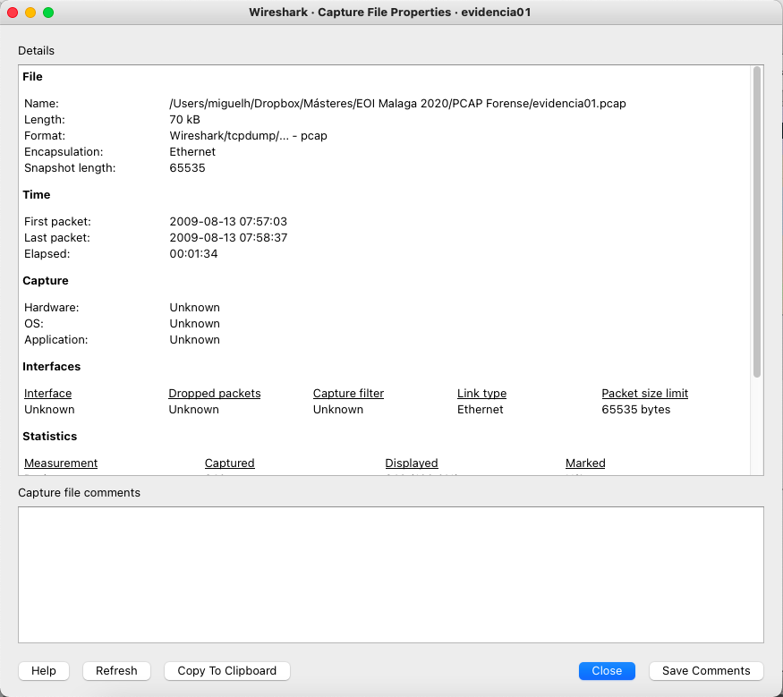

# Fundamentos de Análisis de trafico de red

* Network Forensics!

---

* Quien soy
  * Miguel Herrero Collantes.
  * Ingeniero técnico de telecomunicación Sistemas electrónicos
  * Ingeniero de Telecomunicación.
  * Responsable de Seguridad de red de EEAS (Bruselas) (2021-Actualidad).
  * Analista de SOC en el Consejo de la UE (Bruselas) (2017-2021).
  * Consultor de ciberseguridad para empresas financieras (2015-2019).
  * Técnico de ciberseguridad de Incibe (2011-2017).
  * Correo electrónico: mhercol[@]gmail[.]com


---

* Contenido
```bash
Sesión 1 (2h): Visibilidad y Arquitectura
• Modelo TCP/IP y fundamentos de red
• TAPs vs SPAN: Acceso al dato en arquitecturas corporativas
• Desafío Zero Trust: Cifrado y microsegmentación
• Lab 1: Análisis básico con Wireshark (Ana)
Sesión 2 (2h): Análisis Profundo y Caza de Amenazas
• Protocolos críticos: DNS, HTTP/S, ICMP
• Descifrado de TLS 1.3 con SSLKEYLOGFILE
• Netflow y análisis de flujos
• Labs Avanzados: Mr. X / Reconocimiento
```


---

# Protocolos 101


---

# Modelo TCP/IP

* El análisis forense de la red se centra principalmente en las capas 2, 3 y 4 de la capa OSI
* También analiza las capas superiores, aunque generalmente como una única capa
* Por eso se usa el modelo TCP/IP en lugar del OSI


---

# Modelo TCP/IP

* En la capa de aplicación se generan los datos de usuario
* La capa de transporte (TCP) añade encabezados de transporte
  * Origen, destino, puertos…
* La capa de red (IP) añade sus cabeceras de red para enviar el paquete salto a salto
* Después la tarjeta añade sus cabeceras y colas a la trama para asegurarse del correcto transporte de la trama
* En destino se desencapsula en sentido inverso


---

# Encapsulamiento OSI


---

# Capas encapsuladas en Wireshark


```bash
Wireshark muestra su interpretación de la trama. 
¡Esta interpretación puede no ser correcta!
Las capas están formadas por bytes que aparecen de forma secuencial en el paquete
```


---

# Capas encapsuladas en Wireshark

* Las capas están formadas por bytes que aparecen de forma secuencial en el paquete


* Datos HTTP
* Cabecera TCP
* Cabecera IP

---

# Decimal – Binario - Hexadecimal

* Son los tres tipos de numeración que vamos a usar principalmente.
* Base 10. Dígitos del 0 al 9
* 1 9 8 = 1*100 + 9*10 + 8*1 = 198
* Base 2. Dígitos 0 y 1
* 1 1 0 0 0 1 1 0 = 1*128 + 1*64 +1*4 +1*2 = 198
* Base 16. Dígitos del 0 al 9 y letras de la A a la F.
* 0x c 6 = 12 * 16 + 6*1 = 198
* Notación Hexadecimal
* Binario a Hex…
* 1 1 0 0 0 1 1 0 -> 0xc6
* Cada 4 bits (nibble) se convierten directamente a 1 valor hexadecimal

---

# Arquitectura de Captura Corporativa

## Visibilidad Norte-Sur

  * Tráfico que cruza el perímetro (Firewalls, Proxies, Internet Gateway)
## Visibilidad Este-Oeste

  * Tráfico lateral entre servidores/microservicios (el más difícil de capturar)
## Acceso al Dato:

  * TAP: Copia física, infalible pero costoso
  * SPAN/Mirror: Copia lógica, puede perder paquetes
  * Cloud: VPC Flow Logs y Virtual TAPs

---

# El Desafío Zero Trust (ZT)

```bash
Cifrado Everywhere
mTLS y TLS 1.3 ocultan el payload incluso internamente
Microsegmentación
Tráfico lateral aislado, no pasa por Core Switch
Impacto Forense
PCAP inútil sin llaves de sesión
Estrategia: SSLKEYLOGFILE
Recolección de llaves en endpoints para descifrado en Wireshark
```


---

# Network Forensics en Cloud (2025)

## Desafío: No hay acceso físico a cables

## AWS

  * • VPC Flow Logs: Metadatos de conexión (5-tupla, bytes, packets)
  * • VPC Traffic Mirroring: PCAP completo copiado a EC2/Network Load Balancer
## Azure

  * • NSG Flow Logs: Equivalente a VPC Flow Logs
  * • Network Watcher Packet Capture: PCAP temporal (máx 5h, 10GB)
## GCP

  * • VPC Flow Logs: Muestreo configurable (1:1 a 1:1000)
  * • Packet Mirroring: Clona tráfico a collector instance
## ⚠️ Flow Logs NO contienen payload (solo headers L3/L4)


---

# De Hexadecimal a Decimal

* Sea la cabecera UDP 0x0401 0035 004c 1fd7
* Calcular en decimal el puerto de origen y el de destino


* Origen: 0401 -> 4*16^2 + 1 = 1024+1= 1025
* Destino: 0035 -> 3*16 + 5 = 53

---

# PCAP

* PCAP significa Packet Capture, o captura de paquetes
* Graba la actividad de red complete de las capas 2 a 7
* El formato más coún es libpcap:
  * Open source
  * Disponible en *nix y Windows
  * Librería en C, con módulos en muchos lenguajes

---

# Quién usa PCAP

* Investigadores para acceder a la información en crudo
* Administradores de la red para depurar los problemas de la red
* Analistas para analizar y caracterizar la actividad del malware
* Respuesta a incidentes para perseguir malware

---

# Tcpdump

* Es la herramienta de captura de tráfico más usada
* Open Source
* Multiplataforma
* Basada en libpcap
  * Usa sintaxix de BPF (Berkeley Packet Filter)
  * Muestra detalles en la terminal o guarda los paquetes en un pcap
  * Lee de la red, o de un pcap existente

---

# Formato de Libpcap

* En la cabecera del archivo encontramos:
* Magic number (0xa1b2c3d4 o 0xd4c3b2a1)
* Version
* Timezone Se almacena en UTC, siempre vale 0
* Precisión (también vale siempre 0)
* Máximo tamaño de los paquetes
* Tipo de enlace
* Cada paquete tiene una cabecera con Timestamp, longitud y longitud sin truncar


---

# pcap Vs pcapng

* Por las limitaciones de pcap, en 2004 se propuso un formato nuevo llamado pcapng
* Permite almacenar capturas de múltiples interfaces enel mismo archivo
* Mejora la resolución de los timestamps
* Expande los metadatos con comentarios, estadísticas, actividad DNS…
* Actualmente se usa en muchas herramientas, pero no todas son compatibles
* Se recomienda convertir pcapng a pcap antes de manejarlas con determinadas herramientas.
* Editcap –F pcap archivo.pcapng archivo.pcap

---

# Pregunta…

* ¿Cuanto sobrecarga añade libpcap al almacenar paquetes durante una hora para un enlace saturado simple de 1Gbps con un tamaño medio de paquete de 1500 bytes?

---

# Sobrecarga de libcap


---

# Filtros BPF

* Proporcionan una sintaxis para designar el tráfico que es interesante o que hay que descartar.
* Es la forma más eficiente de limitar qué paquetes pueden ser procesados.
* Varias primitivas:
  * Protocolos: tcp, udp, ip, icmp
  * Equipo: host (direcciones IP) ether (direcciones MAC) net, port…
* Cualificadores: src, dst (van antes de las primitivas, menos con ether, que va detrás)
* Lógicas: and, or, not, ()
* Ejemplos:
* host 192.168.1.1  captura solo los paquetes que vengan o vayan a dicho host
* tcp and port 53  capturara sólo los paquetes TCP con destino u origen puerto 53
* tcp and dst port 53  captura sólo los paquetes TCP con destino el puerto 53
* tcp and (port 80 or port 443 or port 8080) and (not dst host 192.168.111.7)
* Cuanto más complejo el filtro, más probable que haya errores de sintaxis. Probadlos primero en el lab!!!

---

# GUI wireshark

* Panel de lista de paquetes
* Panel de detalles del paquete
* Panel de bytes del paquete
* Filtros

---

# Wireshark

* Una forma de afrontar un nuevo PCAP es mediante la observación de las estadísticas de la conexión
* Permitirá hacerte a la idea de lo que hay en el PCAP y lo que puedes buscar y encontrar


---

# Wireshark

* El capture filter properties presenta el número de bytes presentes en el PCAC y el número de paquetes grabados
* El tamaño en bytes (length) y el de las estadísticas no es igual porque en el tamaño se incluyen metadatos como la timestamp, que no es parte de los paquetes.



---

# Wireshark

* También podéis buscar un paquete en concreto
* Los valores por defecto no son demasiado útiles. Casi siempre querréis buscar una string en packet bytes
* Packet list: buscar por IP de origen, destino…
* Packet bytes: buscar en la payload del paquete
* ¡¡Una vez encontréis el paquete que os interesa… Follow the stream!!


---

# Filtros de Wireshark

```bash
No confundir filtros de captura (similar a los filtros BPF) con filtros de visualización (muestran paquetes específicos)
Wireshark tiene muchos decodificadores de prococolos
Permiten examinar o mostrar campos de un determinado prococolo
Tiene varias formas de seleccionar y crear los filtros
Presencia del protocolo: arp, dns, ftp.response
Condiciones: udp.checksum_bad
Según valores de un campo: ip.src == 192.168.1.1
```


---

# Operadores de Wireshark


---

# Operadores de Wireshark

* El operador matches no está muy bien documentado.


---

# Operadores de Wireshark

```bash
Cuidado con el operador !=
Ip.addr != X no sirve para encontrar todos los paquetes donde la IP no sea X.  Para Wireshark, el paquete debe contener una dirección IP que no sea X, y lo comprobará contra tanto dirección de origen como de destino
!(ip.addr == ) se traduce a que ninguno de los dos campos tengan ese valor, por lo que filtra correctamente 
Fijáos que el color de la barra del filtro no es igual en ambos casos. El amarillo significa que aunque puede hacerlo, a lo mejor no es lo que nosotros queremos buscar.
```


---

# Operadores de Wireshark

* El operador contains permite hacer búsquedas más granulares que el buscador de paquetes, permitiendo buscar en lugar de en todo el paquete, solo en una parte de las cabeceras


---

# Crear filtros en Wireshark

* Filtros por defecto
* Son filtros habituales
* Vienen unos cuantos, accesibles a través de
  * Manage Display filters


---

# Crear filtros en Wireshark

* Filtros por defecto
* Son filtros habituales
* Vienen unos cuantos, accesibles a través de
  * Manage Display filters


---

# Crear filtros en Wireshark

```bash
Mediante la barra de filtros, introduciendo la sintaxis
Wireshark tiene una función de autocompletar
```


---

# Crear filtros en Wireshark

* Mediante el botón expression


---

# Crear filtros en Wireshark

* Seleccionando un paquete, o una parte de un paquete


---

# Filtros de captura

* Cuando se abre un PCAP se puede elegir determinados filtros de lectura del paquete
* Solo aparecerán en el panel aquellos paquetes que cumplan las condiciones del filtro
* Sirve para filtrar el pcap si es muy grande


---

# Exportar objetos de Wireshark

```bash
Wireshark puede exportar objetos HTTP
Se pueden salvar para analizarlos después
```


---

# Un poquito de protocolos…

* “Attackers bend and break protocols in order to smuggle covert data, sneak past firewalls, bypass authentication, and conduct widespread denial-of-service (DoS) attacks.” (Davidoff & Ham, 2012)

---

# La capa de enlace


---

# Capa de enlace IEEE 802.x

* Conjunto de estándares desarrollados por el IEEE
* Casi todas las capas de enlace caen en la familia 802.x
* 802.3 Ethernet
* 802.11 Wireless
* 802.15.1 Bluetooth

---

# Capa de enlace IEEE 802.x

* Casi todas las redes serán Ethernet II
* 14 bytes de cabecera + payload variable +4 bytes CRC
* Ether Type
* IPv4: 0x0800
* IPv6 0x86DD
* ARP 0x0806
* VLAN 0x8100
* Hay un tamaño mínimo de trama (14 + 46 + 4 bytes) por el mecanismo de prevención de colisiones de la capa de enlace.


---

# Capa de enlace IEEE 802.x


---

# ARP

* Protocolo de resolución de protocolos (Address Resolution Protocol)
* Se usa cuando dos equipos quieren hablar en el mismo segmento de LAN
* En nuestro caso, 10.0.01 no sabe cuál es la dirección Ethernet de 10.0.0.2


---

# Problemas de ARP

* ARP no es un protocolo seguro
* No se puede validar la autenticidad del que envía la trama
* Todos los que están escuchando la trama actualizan la cache cuando hay un nuevo par IP/MAC en una petición o respuesta de ARP
* Puede haber usuarios que respondan a todo para hacer MITM


---

# Capa de red: IP


---

# Internet Protocol

```bash
Diseñado para manejar el enrutamiento y el direccionamiento
Opera en capa 3 (Capa de red)
No orientado a conexión
No confiable
Incluye cabecera, pero no pie 
La cabecera y el payload en conjunto son un paquete IP.
```


---

# IPv4 vs IPv6

* Direccionamiento 32 bit
* 232 (approx. 4.3 billones) direcciones
* RFC 791
* Direccionamiento de 128 bits
* 2128 (340 undecillones) direcciones
* RFC 2460 ,RFC 4291


---

# Cabecera de IPv4

* Versión: Puede valer 4 (IPv4) o 6 (IPv6). Cualquier otro valor descarta el paquete
* Protocol: Indica el tipo de protocolo usando. Valores comunes ICMP (1), TCP (6) UDP (0x11)
  * Este campo es lo que hace nmap por debajo para comprobar qué puertos están abiertos
  * Si no hay un mensaje de ICMP de respuesta, el puerto está abierto
* TTL: Numero de saltos por los que un paquete puede pasar
* ECN: Notificación de Congestión Explicita
  * 0 0 No ECN
  * 0 1 ECN Aware
  * 1 0 ECN Aware
  * 1 1 Congestiónn


---

# Fragmentación de IPv4

* La fragmentación divide un paquete demasiado grande para la red en múltiples paquetes
  * Tamaño máximo en IP: 64Kbytes
  * Como por debajo suele haber ethernet, 1500 es el valor más común.
* No existe garantía de que estos paquetes llegarán en el orden adecuado a su destino
* Todos los fragmentos del mismo paquete deben tener el mismo ID
* El valor lo marca el host que envía el paquete
* Actualmente este campo se aleatoriza
* Offset marca la posición de este paquete dentro del fragmento. Siempre es múltiplo de 8
* Si hay más fragmentos, la flag M estará activa. Sólo el último fragmento tendrá M a 0


---

# IPv6

  * Las direcciones publicas de IPv4 llevan 20 años agotándose
  * Redes privadas y NAT van añadiendo vida a las direcciones
  * Enrutamiento más sencillo
  * Tiene mecanismos de seguridad nativos
  * Cifrado
  * Comprobación de integridad
  * Autentifica al que envía el mensaje
  * Mejores características de QoS
  * Permite payloads mayores

---

# Capa de transporte: TCP/UDP/ICMP


---

# TCP vs UDP

* Transmission Control Protocol
  * Confiable
  * Con secuenciación
  * Orientado a conexión
  * Puertos del 0 – 65535
  * Cabecera, pero no resumen
  * Cabecera y payload – segmento TCP
  * RFC 793
* User Datagram Protocol
  * No confiable
  * No orientado a conexión
  * Puertos del 0 – 65536
  * Cabecera, pero no resumen
  * Cabecera y payload – datagrama UDP
  * RFC 768


---

# Establecimiento de la conexión TCP


---

# Fin de la conexión TCP


---

# UDP

* Protocolo ligero y sencillo
* Con poca sobrecarga de cabecera
* No confiable
* Sin orden en el mensaje
* Sin control de flujo
* Muchos protocolos importantes son UDP
* DNS
* NTP
* SNMP
* DHCP
* Cuando se diseñaron no había mucho concepto de seguridad

---

# UDP

* Muy simple:
* Puerto origen
* Puerto destino
* Tamaño del paquete:
  * 16 bits,
  * Tamaño total en bytes  de cabecera y datos
  * Valor mínimo de 8
  * Si vale 0 es un jumbograma
* Checksum: si falla, se descarta el paquete
* Información NTP en este caso


---

# ICMP

* Creado para reportar problemas no temporales o que no se resolverán fácilmente
* Fragmentación necesaria en IP, pero el flag de no fragmentar DF=1
* Puerto no accesible a capa de transporte
* También para intercambiar información simple
* Los mensajes de error contienen información del paquete erróneo
* Es habitual bloquearlo en las redes corporativas
  * Dificulta el descubrimiento de la red
  * Anula el descubrimiento del tamaño de trama, y puede generar problemas de red

---

# ICMP Echo Request / Reply (PING)

* Mismo identificador, diferentes números de secuencia para controlar el ping

---

# Capas superiores


---

# DNS

```bash
DNS traduce nombres de dominio en direcciones IP.
Involucra distintos servidores: resolutores, servidores raíz, TLD y autoritativos
```


---

# DNS

* Sección Answer contiene los Registros que devuelve el DNS
* Secciones (Autoridad y Adicional) se usan principalmente en respuestas desde servidores autoritativos o cuando hay redirección.


---

# DNS Records


---

# Sabores DNS


---

# HTTP/S

* HTTP: Protocolo de texto claro para comunicación web (puerto 80).
  * Uso muy reducido, casi todo es HTTPS
* HTTPS: HTTP sobre TLS/SSL (puerto 443), cifrado punto a punto.
  * Para verlo, hay que interceptar trafico mediante proxys
  * Instalar certificados raíz en los clientes
* Vector muy común y difícil de bloquear
  * Transporta navegación, APIs, malware, C2, etc.
  * Casi todos los campos del paquete son manipulables
* Los NGFW incorporan bastantes medidas de protección

---

# HTTP/S


---

# HTTP/S


* www.example.com


---

# HTTP/S Códigos de respuesta


---

# Descifrado de TLS 1.3 en Wireshark

```bash
El Desafío: TLS 1.3 elimina RSA key exchange
• TLS 1.2: Podíamos usar clave privada del servidor
• TLS 1.3: Perfect Forward Secrecy (PFS) obligatorio → Necesitamos session keys
Solución: SSLKEYLOGFILE
Linux/Mac:
export SSLKEYLOGFILE=~/tls_keys.log
Windows:
setx SSLKEYLOGFILE C:\tls_keys.log
Wireshark:
Edit → Preferences → Protocols → TLS → (Pre)-Master-Secret log filename
Navegador:
Chrome/Firefox exportan automáticamente si la variable existe
Captura:
Iniciar captura → Navegar → Ver HTTPS descifrado en Wireshark
⚠️ Solo funciona si controlas el endpoint que genera el tráfico
```


---

# Forense de red


---

# Analisis Forense de Red

* El el arte de reunir evidencias en la escena de un crimen
  * Reconstruir las acciones del criminal
  * Conseguir pruebas para la acusación
* El forense de red es una de sus ramas, que se relaciona con la monitorización y el análisis del tráfico de la red  para reunir información, evidencias legales o detección de intrusos.
* Bastante difícil y depende mucho de la calidad y cantidad de la información que dispongas y mantengas
* Las investigaciones de red manejan información dinámica y muy volátil.

---

# Analisis forense de Red

* Examina el tráfico que ha atravesado la red
* Correlación con indicadores notables o actividades anómalas
* Trata de responder a las siguientes preguntas:
  * Quién
  * Qué
  * Dónde
  * Cuando
  * Cómo
  * Por qué

---

# Componentes

* Captura y almacenamiento de la información
* Indexación de la información para su manejo
* Análisis de información

---

# Usos

* Búsqueda y solución de errores
  * Encontrar errores en los dispositivos de red
  * Mala configuración del software
  * Latencia
  * Pérdida de paquetes
  * Errores de red y de servicio

---

# Usos

* Seguridad
  * Detección de intrusos
  * Identificar y definir firmas para tráfico malicioso
  * Descubrir pasivamente equipos y servicios
  * Examen forense
  * Tráfico de red como evidencia
  * Comprobar las regals del Firewall
  * Validad seguridad en los login…

---

# Usos

* Optimización
  * Analizar el uso del ancho debanda
  * Evaluar la eficiencia de los tamaños de los paquetes en aplicaciones
  * Analizar el tiempo de respuesta entre redes
  * Validar configuraciones de sistemas adecuados
* Análisis de aplicaciones
  * Analizar ancho de banda de aplicaciones
  * Identificar protocolos y puertos
  * Validar aplicaciones de seguridad

---

# Arquitectura de red corporativa

* Una empresa pequeña puede tener una estructura de red mas o menos sencilla
* LAN
* Servidores
* Un par de FW para segmentar
* Segmento Wifi


---

# Arquitectura de red corporativa

* A medida que crece…
  * Varios edificios conectados con Fibra Oscura privada
  * Oficinas remotas
  * Teletrabajadores
  * Entornos de administracion privilegiados
  * Servidores en la nube

---

# Arquitectura de red corporativa


---

# Información de red

* A la hora de hacer un análisis forense de la red podemos tener los siguientes orígenes de información de la red:
  * Paquetes completos
  * Flujos de información
  * Una combinación de ambos elementos
  * Ninguna
  * Archivos de logs de equipos / elementos de red

---

# Tipos de información


---

# Paquetes completos


---

# Información de sesiones

* Una sesión es un intercambio temporal de información entre dos o más equipos.


---

# Retos de la recolección de red

* Aunque recolectes todo el tráfico, aun así, habrá que solucionar una serie de retos:
* Poco periodo de retención
* FPC de eventos de interés?
* ¿Recolección en toda la red, o sólo en una parte?
* Tráfico cifrado.
* Túneles o uso de puertos no comunes
* Atribución de NAT o DHCP
* Riesgos relacionados con el almacenamiento de información

---

# Conocimientos necesarios

* Además de entender las herramientas, los forenses de red deberían tener conocimientos de…
  * Networking
  * Protocolos de red y de aplicación más comunes
  * Productos y aplicaciones de seguridad
  * Amenazas y ataques típicos de red
  * Entorno de la empresa
    * Arquitectura de red
    * Direcciones IP de los activos (FW, Proxy…)

---

# Metodología

* La metodología de la investigación forense se basa en:
* El tipo de información que está disponible
* El tipo de incidente
* Los detalles del mismo
* Es un proceso iterativo
* No existe una formula precisa para la metodología
* Los IOC pueden redirigir el análisis

---

# Fases de un ataque

* Pre-explotación
* Reconocimiento
* Explotación
* Penetración con éxito
* Post-explotación
* Mantener acceso
* Elevación de privilegios
* Reconocimiento de la red interna
* Movimientos laterales
* Exfiltración de la información

---

# Pegasus

* iPhone recibe SMS con un .gif
* imessage
* No es un GIF es un PDF con extensión .gif
* imageIO
* Parse this PDF
* PDF en JBIG2, que permite operadores AND, OR, XOR y XNOR.
* Vulnerabilidad de Buffer overflow, acceso a memoria fuera del proceso
* El PDF es un script con más de 70.000 comandos definidos con operadores lógicas. Crea una pequeña arquitectura funcional equivalente a JS. ¡¡Gracias Moore!!


* escape the sandbox
* coregraphics PDF Parser

---

# Técnicas de análisis de paquetes

* Búsqueda de cadenas:
  * Identificar paquetes que contengan valores específicos en un PCAP
* Parsear los campos de protocolos
  * Extraer el contenido de los campos del protocolo
* Filtrado de paquetes
  * Separar paquetes según el valor de los metadatos

---

# Metodología de Threat Hunting en Red

```bash
Framework de Caza de Amenazas
1. Hipótesis
  ¿Qué comportamiento anómalo busco?
  → Ejemplo: Beaconing C2 cada 60 segundos
2. Búsqueda
  Aplicar filtros y análisis estadístico
  → Ejemplo: dns.qry.name + estadísticas de intervalos
3. Validación
  ¿Es malicioso o legítimo?
  → Ejemplo: Correlación con VirusTotal, context IOCs
4. Remediación
  Bloquear, aislar, documentar
  → Ejemplo: Firewall rule + incident report
```


---

# Fuentes de información de la red

* Capturas PCAP
  * Fuente principal de información, ya hemos hablado de ellas
* Esnifar las redes Wifi
  * Normalmente WLAN
  * Normalmente la información va cifrada pero se puede obtener algo de información
  * Las frames de control y gestión no suelen ir cifradas
  * Los AP anuncian nombres, presencia y capacidades
  * Los equipos se conectan a los AP y estos les responden
  * La MAC de equipos legítimos autenticados
  * Análisis estadístico de tráfico a partir del volumen

---

# Fuentes de información de la red

* Switches
  * Equipos de capa 2
  * Son puentes multipuerto que básicamente interconectan segmentos de red
    * La mayor parte de las redes, conectan los switches entre si para formar estructuras complejas
  * Información forense:
    * Tabla Content addressable memory (CAM)
    * Mapean los puertos físicos a las MAC, por lo cual nos pueden ayudar a ubicar un dispositivo

---

# Fuentes de información de la red

* Routers
  * Conectan tráfico y lo encaminan entre diferentes redes o subredes.
  * Permiten la comunicación entre diferentes esquemas de direccionamiento
  * Permiten las MAN, WAN y LAN
  * Información forense:
    * Tablas de enrutamiento
    * Mapean los puertos del router a las redes que conectan
    * Permiten investigar el path de las comunicaciones
    * Pueden hacer filtrado de paquetes
    * Tienen logs y almacenan información de los flujos de la red
    * Son los IDS más desplegados y los más rudimentarios

---

# Fuentes de información de la red

* Servidores DHCP
  * Permiten la configuración dinámica de los equipos
  * Asignan dirección IP a los equipos de la LAN
  * Información forense
    * La investigación suele comenzar con una IP
    * Los DHCP contienen
    * Cuando se hace la petición
    * IP asignada
    * MAC del equipo
    * Tiempo de duración
    * Hostname del solicitante

---

# Fuentes de información de la red

* Servidores DNS
  * Mapean IP a hostnames en una organización
  * Resuelven nombres para todos los equipos
  * Información forense
    * Tienen un log de las peticiones recibidas
    * Intentos de conexión desde el interior al exterior ej.: sitios web, servidores SMTP…
    * Tiempos de la conexión
    * Permiten crear la línea de tiempo de las actividades sospechosas

---

# Fuentes de información de la red

* Servidores de Autenticación
  * Servicios de autenticación centralizados Centralized authentication services
  * Provisionamiento de cuentas y tareas de auditoría
  * Información forense
    * Intentos fallidos o exitosos de autenticación
    * Ataques de fuerza bruta
    * Horas de conexión sospechosas
    * Localizaciones poco usuales para el usuario
    * Cambios de privilegios no esperados

---

# Fuentes de información de la red

* NIDS
  * Los IDS y los NIPS están diseñados para el análisis y la investigación
  * Monitorizan tráfico en tiempo real
  * Detectan y alertan de eventos sospechosos
  * Información forense
    * Actividades sospechosas en curso
    * Tráfico a los C&C
    * Fugas de información
    * Pueden permitir recuperar el contenido entero de los paquetes de red
    * Aunque normalmente únicamente permiten IP de origen y destino, puertos y tiempo del evento

---

# Fuentes de información de la red

* Firewalls
  * Inspección de paquetes con tres acciones: enviar, descartar y registrar
  * Se basan en direcciones IP, payloads del paquete, número de puerto y encapsulamiento
  * Información forense
    * Registro granular de eventos
    * Funcionan como protección de infrastructura e IDS
    * Mantienen logs del tráfico permitido y denegado
    * También logs de cambios de configuración, errores u otros eventos

---

# Fuentes de información de la red

* Proxies
  * Mejoran el rencimiento mediante el cacheo de web
  * Registran inspeccionan y filtran el tráfico web
  * Información forense
    * Los logs granulares pueden almacenarse durante mucho tiempo
    * Informes visuales de perfiles de navegación según las IP o usernames (junto a los AD)
    * Permiten analizar
    * Intentos de phishing exitosos
    * Navegación web no adecuada
    * Malware basado en web
    * Ver lo que vio el usuario a través de la caché

---

# Fuentes de información de la red

* Servidores de aplicación
  * Bases de datos
  * Servidores Web
  * Servidores de correo
  * Servidores de IM
  * Servidores de VOIP
  * Utilidad forense:
    * Guardan los logs de sus aplicaciones, por lo que son básicos para descifrar lo que en realidad pasó

---

# Fuentes de información de la red

* Servidores de logs centralizado
  * Combina los logs de muchas fuentes y son correlacionados, analizados y fechados de forma automática
  * Dependen mucho de cada organización
  * Información forense:
    * Diseñados para identificar y responder a eventos de seguridad
    * Salvan la información si un servidor está comprometido
    * Retienen información de los equipos de red durante más tiempo que la que permiten los dispositivos de red
    * Pueden producir análisis forenses y representación gráfica de la información

---

# Laboratorios PCAP


---

# ⚠️ Errores Comunes en Análisis de Red

```bash
Aprende de estos errores frecuentes:
❌ Confiar ciegamente en timestamps
NTP drift puede causar desfases de minutos/horas entre equipos
✅ Verificar: ntpq -p o comparar con fuente autoritativa
❌ No validar integridad del PCAP
PCAP corrupto o truncado = análisis inválido
✅ Siempre ejecutar: capinfos archivo.pcap
❌ Ignorar MTU y fragmentación
Payloads > 1500 bytes se fragmentan, puedes perder contexto
✅ Buscar: ip.flags.mf == 1 o tcp.analysis.retransmission
❌ Buscar passwords sin considerar cifrado
Hoy el 95% del tráfico web es HTTPS
✅ Busca en HTTP, FTP, Telnet, SMTP (legacy)
❌ No documentar la cadena de custodia
PCAP sin hash MD5/SHA256 = inadmisible en juicio
✅ md5sum *.pcap > checksums.txt al capturar
❌ Analizar sin conocer la red
¿Qué es normal? ¿Cuánto tráfico DNS es esperado?
✅ Establece baseline ANTES del incidente
```


---

# Lab 1

* Una empresa sospecha que una empleada, llamada Ana, es en realidad un agente secreto que trabaja para su competencia. Ana tiene acceso al activo más importante de la empresa, la RECETA SECRETA.
* El equipo de seguridad teme que Ana mande la receta secreta a sus competidores. Han estado monitorizando la actividad de Ana durante un tiempo, pero no han encontrado nada, hasta ahora…
* Hoy, un portátil apareció brevemente en la red Wifi de la empresa. El equipo de seguridad cree que fue alguien desde el parking.
* El equipo de Ana 192.168.1.158 envió mensajes instantáneos a ese equipo a través de la Wifi. El portátil desapareció poco después…

---

# Buscamos respuestas

* Cómo se llama con quien está hablando Ana
* Cual es el primer comentario en la conversación de mensajería
* Cual es el nombre del archivo que transfirió Ana.
* Obtener el documento intercambiado
* El archivo pcap es evidence01.pcap

---

# Buscar la conversación de IM


---


---


---

# Abrirlo con un editor hexadecimal

* Limpiar el HEX, todo lo que esté antes y después del PK (504B0304)
* Salvar como docx


---


---

# Lab 2

* El juez dejo libre a Ana bajo fianza. Momento en el cual aprovechó para escapar.
* Afortunadamente los investigadores la estaban monitorizando antes de que huyera.
* Creen que Ana se ha comunicado con Mr. X, su amante antes de huir. Creemos que hay pruebas de dónde se fueron en este PCAP: Evidencia02.pcap

---

# Buscamos respuestas

* Cuál es la dirección de correo de Ana
* Y su contraseña
* Cuál es la dirección de correo de Mr. X
* Qué dos cosas le pide Ana que lleve a Mr. X
* Cuál es el nombre del adjunto que Ana le manda a Mr. X
* En qué ciudad y país se producirá la reunión

---

* 2 conversaciones. Abrimos la primera
* Correo electrónico, puede ser el nuestro?


---

# No, la segunda si lo es…


---


```bash
Las ultimas versiones de Wireshark permiten exportar directamente los eml
Antes era más artesanal (con dump hexadecimal)
```


---


---

# Lab 3

* Mientras estaba en México, Mr. X se infiltra en el ANFRF.
* Una vez dentro, pivota a un sistema comprometido y hace algo de reconocimiento de red nada silencioso
* Afortunadamente tenemos un PCAP con la actividad: Evicencia03.PCAP

---

# Buscamos respuestas

* Cuál es la IP del escáner de Mr.X
* ¿Qué tipo de escaneo de puertos es el primero que hace?
* TCP SYN
* TCP ACK
* UDP
* TCP Connect
* TCP XMAS
* TCP RST
* Cuáles son las IP de los objetivos que descubre Mr. X
* ¿Cuál es la MAC del equipo de Apple que descubre?
* ¿Cuál es la IP del equipo Windows que encuentra?
  * Pista: Buscad los TTL de Windows en google…
* Qué puertos estaban abiertos en este sistema Windows?

---

* En statistics endpoints hay varios equipos involucrados. Por el número de paquetes, podemos deducir cual es Mr.X
* Para saber qué tipo de escaneo usamos un filtro para ver las flags ack y syn: TCP connect


---


---


---

# Lab 4

* Una infección por malware
* Un usuario pinchó en un enlace que no debía…
* Afortunadamente tenemos un PCAP
  * Protegido por contraseña: “infected”
  * Tened cuidado, que ahí dentro hay un bicho…

---

# Buscamos respuestas

* Fecha y hora de la infección
* MAC del equipo Windows infectado
* IP del equipo Windows
* Hostname
* Malware con el que se ha infectado

---


---


---

* Añadimos la columna host


* Supersospechoso!!!


---

# Flujos de información (Network Flows)


---

# Análisis de flujos

* Un flow (flujo) es un resumen de trafico unidireccional que comparte:
* IP origen
* IP destino
* Puerto origen
* Puerto destino
* Protocolo
* Los datos de un flujo contienen:
* Los 5 elementos anteriores
* Las flags de TCP
* Bytes y paquetes totales
* Hora de inicio, de fin, duración y el sensor que ha recolectado el flujo

---

# Análisis de flujos

* El análisis de flujos se realiza tipicamente para
* Identificar patrones en el tráfico
* Aislar actividad sospechosa
* Analizar protocolos de capas superiores
* Extraer información
* Se definen en RFC 3954 como una secuencia unidireccional de paquetes con alguna propiedad común que atraviesan un equipo de red
* Un flujo consiste en todos los paquetes de una conexión de sesión de transporte o de media. Sin embargo un flujo no mapea 1:1 a una conexión de transporte necesariamente.

---

# Análisis de flujos

* Netflows / IPFIX
* Desarrollados en 1996 por CISCO. Actualmente en manos del IETF
* Se han convertido en el estándar de colección de información de tráfico IP
* Se usan para monitorizar y analizar el tráfico de la red
* Versiones 5,7 o 9 son las más comunes
* IPFIX se le considera v10 de Netflow, alejándose de Cisco
* sFlow / jFlow
* www.sflow.orf es el estándar de la industria para el muestreo de flujos
* Con menor granuralidad
* jFlow es la implementación de Juniper de sFlow

---

# Netflow v9


---


---

# Ejemplo de uso de flujos


---

# Diferencias entre PCAP y *flows

* Un PCAP es como escuchar en un hilo telefónico
* Un *flow es como mirar la factura de teléfono.
  * Sabes quien habló con quién, pero no de qué
* Esta granularidad permite escalar para almacenar grandes cantidades de información
  * Se puede aprender mucho de mirar la facture del teléfono
  * Quien se comunica con quien, qué prococolo utiliza, durante cuánto tiempo, a qué velocidad..
  * Los flujos son una forma de telemetría enviada por los routers y los switches. Cada uno es un sensor.

---

# SNMP Vs *Flow

* SNMP es un protocolo para monitorización de red mediante polling
  * Necesita determinar cuándo solicitar información del dispositivo
  * Para cuando se hace el poll, la información puede no estar ahí
  * El equipo no decide en la cantidad de información
  * La correlación puede requerir múltiples peticiones
* Netflows
  * La información se manda de forma asíncrona al nodo que la centraliza
  * Se puede hacer postprocesado (agregación) en el router o switch
  * La información que se exporta se borra inmediatamente

---

# De dónde se obtienen los flows

* Del router o switch
* Generados a partir de PCAP
* Generados de la red mediante probes que analizan el tráfico
* Limitaciones del enlace que se analiza, de hardware…
* Problemas similares a los estudiados cuando hablamos del despliegue de Moloch

---

# Análisis de flujos

* Filtrado
* Básico para reducir el número de evidencias a analizar
* Elimina la información externa
  * Empezar por aislar la actividad relativa a una dirección específica
  * Filtrar por patrones de tráfico conocido
* Usa un pequeño porcentaje de información para el análisis detallado

---

# Análisis de flujos

* Baseline
* Los flujos son muy pequeños en comparación a los PCAP
* Permiten una mayor retención de la información
* Permiten construir un perfil de actividad “normal” en la red
  * Generan tendencias a lo largo del tiempo
* También actividad “normal” de un equipo
  * La actividad de un host se modificará drásticamente si ha sido comprometido

---

# Análisis de flujos

* Valores “sucios” o no deseados
* Similar a las reglas de un IDS
* Permiten incluir una lista de valores no deseados de
  * IP
  * Puertos
  * Protocolos

---

# Análisis de flujos

* Búsqueda de patrones
* Según elementos como IP, puertos o protocolos
* Las conexiones de capa 3 y 4 normalmente se registran
  * Intentos de conexión
  * Escaneo de puertos
  * Transferencia de información y dirección de la transferencia

---

* Captura de paquetes
* Full Packet Capture (FPC)

---

* Necesidad del FPC
* Casi todas las herramientas de seguridad se basan en un modelo de seguridad negativa:
  * Dificilmente pueden gestionar Zero-Days
  * Sufren con el malware nuevo
  * No detectan nada si no tienen firmas
* FPC permite a los analistas revisar todas las comunicaciones de todos los sistemas, lo que puede detectar comunicaciones maliciosas que pasan inadvertidas a las herramientas de seguridad.
* Además permiten hacer retrospección, y reproducir tráfico antiguo a través de nuevos documentos de firmas.
* La retrospección también se puede usar para determinar si hubo un ataque antes de que se desarrollara un parche o una firma.
* Se pueden extraer nuevas firmas o muestras de malware de la información en un FPC.

---

* Requisitos
* Cuando planeamos la instalación de un FPC hay que pensar en tres requisitos:
  * Dónde vamos a colocar el FPC
  * Qué va a monitorizar
  * Cuáles son las necesidades de retención
  * Qué hay de la redundancia y de la escalabilidad
* Y, por supuesto, queremos (o podemos pagar) una herramienta comercial o nos vamos a una OpenSource...

---

* Dónde vamos a colocarlo
* Como norma general, se colocan en los límites entre las redes confiables y las no confiables.
  * Por ejemplo entre la LAN e Internet
  * Entre Internet y la DMZ

---

* Colocación del FPC
* ¿Qué os parece esta arquitectura?
* FPC colocado detrás del FW que funciona como proxy…


---

* Colocación FPC


---

* Necesidad de almacenamiento
* Hay necesidad (legal, quizá) de guardar la información durante determinado tiempo?
* Cuál es el tiempo medio de detección y respuesta a un incidente?
* Hay turnos 24/7 o el SOC sólo está en horas de oficina?
* Si hay medidores formales, el Tiempo Medio de Detección determina el mínimo tiempo necesario para almacenar paquetes.
* Cálculo:
  * Capacidad del enlace x ocupación media del enlace x segundos de almacenamiento

---

* Necesidad de almacenamiento


* .75 Gbps x 1024 x 1024 /8 = 98304 Bps x 72 x 3600 / 1024 / 1014= 24.300 GB
* ¡¡¡Ojo, que además del espacio hay que contar con la velocidad de los discos duros!!!
  * Quizá haya que usar una combinación SSD – HDD
  * O RAID

---

* Como consumir el tráfico
* Los FPC necesitan el tráfico de red
  * ORIGINAL
  * SIN MODIFICAR
  * IMPACTANDO LO MENOS POSIBLE EN EL DESEMPEÑO DE LA RED

---

* Network taps
* Es el método preferido para hacer FPC
* Utiliza un tap físico asegura que el tráfico no se va a diferenciar del original
* No necesitan un SPAN port (el MIRROR del pfsense)
  * Ya que en caso de saturación el SPAN port puede desechar paquetes para mantener la velocidad del switch
  * Además, los SPAN ports pueden saturarse si agregas links con mucho tráfico

---

* Interfaces físicos de captura
* Una vez recibido el paquete original sin modificar, necesitamos unas tarjetas de red de calidad capaz de procesar todo el tráfico
* Suelen incluir chips especializados para gestionar tráficos de red muy altos

---

* Filtrado de paquetes
* Hay veces que no todo el tráfico que se recibe en la TAP es útil
  * Podemos recibir tráfico del propio FPC
  * Tráfico del sistema de backup
* Por ello a veces hay que incorporar filtros BPF en los interfaces de red
  * Lo soportan prácticamente todos los FPC, como OpenFPC, Snort, Suricata o Moloch

---

* Packet brokers
* Si la cantidad de tráfico es tan grande que no es gestionable por un sistema único, hay que desarrollar una arquitectura escalable
* Son las plataformas de Packet Brokers, con las siguientes características:
    * Balanceo de carga
    * Decodificación y procesado
    * Filtrado basado en capas 2-7
    * Descifrado

---

* Escribir los paquetes al disco
* Cuando el tráfico lo recibe el FPC, hay que escribirlo al disco
* Los Discos deberán tener en cuenta
  * La cantidad de tráfico
  * La velocidad de escritura
  * Los procesadores
  * La RAM para cachear paquetes
* Los paquetes normalmente se almacenan, se enriquecen con metadata y se re-almacenan
* Se borran según configuración usando una pila FIFO

---

* Indexar y buscar
* Posteriormente, los paquetes son indexados y almacenados
* Cada solución utiliza su propio sistema de almacenamiento e indexación
  * Por ejemplo, Moloch utiliza Elasticsearch para ello

---

* Akrime AKA Moloch
```bash
Arkime (Moloch) - Full Packet Capture
Sistema open-source para captura, indexación y búsqueda masiva de paquetes
Componentes:
• Capture: Almacena PCAPs completos
• Elasticsearch: Indexa metadatos de sesiones
• Viewer: Interface web para búsqueda
Ventaja: Buscar en terabytes de tráfico histórico en segundos
──────────────────────────────────────────────────
Ejemplos de Búsqueda en Arkime (2025):
Tráfico TLS 1.3 a IPs rusas
protocols == tls && tls.version == "TLSv1.3" && country == "RU"
DNS sobre HTTPS (DoH)
host == cloudflare-dns.com || host == dns.google
Beaconing detectado
packets >= 50 && bytes < 10000 && duration > 3600
Exfiltración vía ICMP
protocols == icmp && bytes.dst > 100000
```


---

# Integración con el Stack de Seguridad Moderno

## El Forense de Red NO ocurre en aislamiento

## Pipeline de Detección y Respuesta:

## 1. Captura

  * TAP/SPAN → Arkime/Moloch (PCAP indexado) + Zeek/Suricata (logs enriquecidos)
## 2. Agregación

  * Flows → Elastic Stack / Splunk / Chronicle (análisis de comportamiento)
## 3. Detección

  * SIEM Rules + ML → Alertas de anomalías (beaconing, DGA, lateral movement)
## 4. Investigación

  * Alerta en SIEM → Pivot a Arkime con timestamp → Extraer PCAP de contexto
## 5. Enriquecimiento

  * IOCs → VirusTotal, AbuseIPDB, ThreatFox → Correlación con EDR (proceso, usuario)
## 6. Respuesta

  * Firewall API → Bloqueo automático + SOAR (Incident ticket + notificación)
## 💡 Clave: PCAP es el 'ground truth' cuando el SIEM duda


---

* Moloch
* Tiene 3 componentes:
  * Molochcapture:
    * Es el servicio de captura de paquetes
    * Parsea las capas 3 a 7 para generar los metadatos SPI
    * Puede hacer importaciones manuales mediante línea de comandos
  * Molochviewer:
    * Aplicación con interfaz gráfico con su propio servidor HTTP  que soporta JSON
    * Permite obtener las sesiones de interés o los PCAP
    * Tiene un API que utiliza URIs por lo que es fácil integrarlo con herramientas CLI
  * Elasticsearch
    * Ya le conocemos, rápido, escalable…
    * Devuelve las consultas en formato JSON
    * Muy buena para mantener sesiones  documentos


---

* Arquitectura


---

* Arquitectura Moloch


* Múltiples nodos de captura
* Dividir el tráfico para poder manejarlo mejor
* Un clúster de ES para almacenar

---

* Información SPI (Session Profile Information)
* De cada sesión se extrae metainformación que se indexa y almacena junto al paquete
  * DNS
    * Direcciones IP
    * Hostnames
  * HTTP
    * Método
    * Códigos de estado
    * Cabeceras
    * Tipo de contenido
  * IP
    * Origen
    * Destino
    * Purertos
    * Protocolos

---

* Información SPI
* De cada sesión se extrae metainformación que se indexa y almacena junto al paquete
  * IRC
  * SSH
    * Nombre del cliente
    * Puerto
    * Llave pública
  * SSL
    * Certificados
    * Nombres
    * Numeros de serie

---

* Información SPI
* SMTP
  * Cabeceras de correo
  * Mensaje
  * Asunto
* Muchas más según los protocolos que Moloch detecte

---

# REGEX


---

# Regex Cheat Sheet para Wireshark

```bash
Patrones Esenciales para Wireshark
(?i) = Case Insensitive (¡Úsalo siempre en user-agents!)
🎯 MALWARE DELIVERY
http.request.uri matches "\.(exe|dll|ps1|bat|vbs)$"
   → Archivos ejecutables descargados
🎯 DGA DOMAINS
dns.qry.name matches "^[a-z]{15,}\.(com|net|org)$"
   → Dominios generados algorítmicamente
🎯 CREDENTIAL THEFT
frame matches "(?i)(password|passwd|pwd)=.{3,}"
   → Credenciales en cleartext
🎯 BOT TRAFFIC
http.user_agent matches "(?i)(bot|crawler|spider|scrapy)"
   → Identificar tráfico automatizado
🎯 SQL INJECTION
http.request.uri matches "(?i)(union|select|from|where)"
   → Ataques SQLi en URLs
🎯 DATA EXFIL
dns.qry.name matches "^[A-Za-z0-9+/]{30,}="
   → Datos codificados en Base64 vía DNS
```


---

# Ejemplos


---

# 🚀 Próximos Pasos en tu Carrera

```bash
Recursos para Profundizar:
📚 Práctica con PCAPs Reales
• Malware-Traffic-Analysis.net (PCAPs de malware actualizados semanalmente)
• PacketTotal.com (Análisis colaborativo de PCAPs)
• NETRESEC.com (Herramientas y recursos de forense)

🎓 Certificaciones Relevantes
• GIAC GCIA (Intrusion Analyst) - Gold standard para análisis de red
• Wireshark WCNA (Certified Network Analyst) - Oficial de Wireshark
• EC-Council CHFI (Hacking Forensic Investigator) - Incluye forense de red
• SANS FOR572 (Advanced Network Forensics) - Curso avanzado

👥 Comunidad y Eventos
• SharkFest (Conferencia anual de Wireshark)
• BSides (Eventos locales de seguridad)
• SANS Internet Storm Center (Amenazas actuales)
```


---

# 🔐 JA3/JA4: TLS Client Fingerprinting

## Identificar malware SIN descifrar el tráfico

## ¿Qué es JA3/JA4?

  * Huella digital del TLS ClientHello basada en Version, Ciphers, Extensions
## Malware Conocido:

  * • Cobalt Strike: e7d705a3286e19ea42f587b344ee6865
  * • Sliver C2: 51c64c77e60f3980eea90869b68c58a8
  * • Trickbot: 6734f37431670b3ab4292b8f60f29984
## Herramientas: ja3er.com, Zeek (ja3.zeek)


---

# 🎭 Advanced Evasion Techniques (2025)

```bash
Técnicas modernas de evasión
• Domain Fronting 2.0
SNI dice cloudflare.com, HTTP Host es C2
• DNS over HTTPS (DoH)
Exfiltración vía dns.google (parece legítimo)
• Protocol Tunneling
SSH sobre HTTP, VPN sobre ICMP
• Time-based Evasion
Beaconing con jitter aleatorio
```


---

# 🎯 APT Kill Chain: Network Indicators

```bash
Qué buscar en PCAP por fase
1. Reconnaissance
→ DNS queries masivas, Shodan patterns
2. Delivery
→ HTTP downloads .doc/.zip
3. C2
→ HTTPS con JA3 malicioso, DGA domains
4. Lateral Movement
→ SMB admin$, RDP, WMI
5. Exfiltration
→ DNS tunneling, uploads grandes
```


---

# ↔️ Detecting Lateral Movement

```bash
Tráfico Este-Oeste sospechoso
• SMB (445/tcp)
admin$, C$, IPC$ shares
• RDP (3389/tcp)
Login desde servidor interno
• WMI (135/tcp)
Remote command execution
• WinRM (5985/tcp)
PowerShell remoting

Red Flag: Servidor web → RDP → Domain Controller
```


---

# 🔒 Encrypted Traffic Analysis (ETA)

## Detectar malware SIN descifrar payload

## Técnicas de Machine Learning:

  * • Packet Size Distribution (malware: uniforme)
  * • Inter-Arrival Times (C2: intervalos constantes)
  * • TLS Certificate Analysis (self-signed, CN mismatch)
  * • Flow Duration vs Bytes (flujo largo, pocos datos)
## Herramientas: Joy (Cisco), Mercury, Zeek ML


---

# 🚀 QUIC / HTTP/3: The New Challenge

## HTTP/3 sobre UDP (50% del web en 2025)

## Desafíos:

  * • No hay TCP handshake (no SYN/ACK)
  * • Connection ID ofuscado
  * • 0-RTT: Primera request ya cifrada
  * • Usado por: Google, Facebook, Cloudflare
## Estrategia: SSLKEYLOGFILE + estadísticas + DNS correlation


---

# 🧠 Memory Forensics + PCAP Correlation

## Correlación de artefactos

## Pipeline:

  * 1. Volcado de Memoria → Volatility3: windows.netscan
  * 2. Extraer conexiones (pid, process, IP:port)
  * 3. Correlacionar con PCAP
  * 4. Identificar proceso malicioso
  * 5. Timeline reconstruction
  * Ejemplo: Memory dice powershell.exe → 185.220.101.45
  * PCAP confirma: HTTP POST a 185.220.101.45:443
