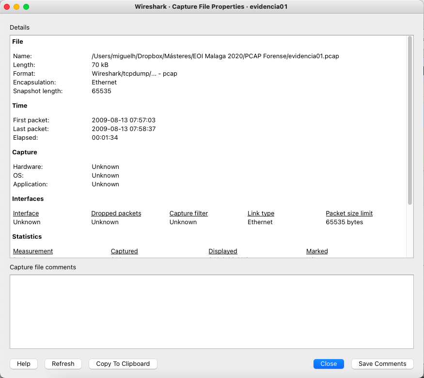

# Fundamentos de Análisis de tráfico de red

<div class="center-content">

## Network Forensics 2026

**Análisis profesional de tráfico corporativo**

</div>

--- 

# Quien soy

<div class="text-img">
<div>

**Miguel Herrero Collantes**

<div class="list-item">Ingeniero técnico de telecomunicación - Sistemas electrónicos</div>
<div class="list-item">Ingeniero de Telecomunicación</div>
<div class="list-item"><strong>Responsable de Seguridad de red</strong> - EEAS (Bruselas) (2021-Actualidad)</div>
<div class="list-item"><strong>Analista de SOC</strong> - Consejo de la UE (Bruselas) (2017-2021)</div>
<div class="list-item">Formación avanzada en DFIR y redes <strong>(GCFA, GDSA, GMON, ECIH)  </strong> </div>

Correo: mhercol[@]gmail[.]com

</div>
<div>


</div>
</div>

---

# Contenido del curso

```
Sesión 1 (2h): Visibilidad, Captura y Protocolos Clave
  ▸ Arquitectura de captura: TAPs, SPAN, Zero Trust, Cloud
  ▸ PCAP, tcpdump, BPF y Wireshark
  ▸ Protocolos clave: ARP, TCP/IP, DNS, HTTP/S
  ▸ Lab 1 [LogiCorp]: Ana y la receta secreta (mensajería + extracción de archivo)
  ▸ Lab 2 [LogiCorp]: Ann Dercover — email personal desde la red corporativa

Sesión 2 (2h): Forense de Red y Caza de Amenazas
  ▸ TLS 1.3: descifrado con SSLKEYLOGFILE
  ▸ Metodología forense, fuentes y técnicas de análisis
  ▸ Lab 3 [LogiCorp]: Reconocimiento de la red interna
  ▸ NetFlow, Full Packet Capture, Arkime
  ▸ Lab 4 [LogiCorp]: Infección de Stewie-PC
```

<div class="highlight-box">

**Apéndice disponible:**
Está pensado como **referencia para** las sesiones presenciales.
A. Modelo TCP/IP y encapsulamiento · B. Sistemas de numeración
C. Formato PCAP / pcapng · D. Herramientas de manipulación de PCAP
E. Protocolos de capa de enlace y red · F. Filtros Wireshark y TCP
G. Cabeceras de protocolo · H. Fuentes de captura
I. NetFlow, Flows e Infraestructura FPC · J. APT Kill Chain — Indicadores de Red

</div>

---

# Mapa del Curso

```
 CASO INTEGRADOR: Empresa "LogiCorp" — Incidente en curso
 ──────────────────────────────────────────────────────────
 [1] CAPTURA                 ¿Cómo recogemos el tráfico?
      └─ TAPs · SPAN · Cloud · PCAP · tcpdump · BPF

 [2] HERRAMIENTAS            ¿Con qué lo analizamos?
      └─ Wireshark · Filtros · Exportación · Streams

 [3] PROTOCOLOS              ¿Qué vemos en el tráfico?
      └─ ARP · TCP · DNS · HTTP · TLS · Marco legal

 [4] ATAQUES                 ¿Cómo detectamos al atacante?
      └─ NetFlow · Arkime · JA3 · Kill Chain · ETA

 ══════════════════════════════════════════════════════════
 [+] AVANZADO (bonus)        Infraestructuras modernas
      └─ Cloud · Kubernetes · eBPF · Contenedores
 ──────────────────────────────────────────────────────────
```

---

# Caso Integrador — LogiCorp

<div class="highlight-box">

**Escenario que articula el curso:**

</div>

<div class="cols">
<div>

**La empresa:**

<div class="list-item"><strong>LogiCorp S.L.</strong> — empresa logística, 300 empleados</div>
<div class="list-item">Red corporativa on-prem</div>
<div class="list-item">Con seguridad básica</div>

**El incidente:**

<div class="list-item">Un usuario interno exfiltra informacion importante de la empresa</div>
<div class="list-item">IT captura traficos interesantes y nos piden ayuda para investigar el caso. </div>

</div>
<div>

<div class="highlight-box">

**Evidencias recibidas:**

<div class="list-item"><code>Evidencia01.pcap</code> — tráfico de la red WiFi</div>
<div class="list-item"><code>Evidencia02.pcap</code> — tráfico saliente en el gateway</div>
<div class="list-item"><code>Evidencia03.pcap</code> — tráfico de segmento interno</div>
<div class="list-item"><code>Evidencia04.pcap</code> — tráfico de un host</div>

</div>

<div class="warn-box">

**Fases de la investigación:**

<div class="list-item">¿Cómo se exfiltró el activo crítico?</div>
<div class="list-item">¿Cómo fue la coordinación con el exterior?</div>
<div class="list-item">¿Qué sistemas fueron reconocidos internamente?</div>
<div class="list-item">¿Qué pasó en el host?</div>

</div>

</div>
</div>

---

# Arquitectura de Captura Corporativa

<div class="cols">
<div>

## Visibilidad Norte-Sur

<div class="list-item">Tráfico que cruza el perímetro</div>
<div class="list-item">Firewalls, Proxies, Internet Gateway</div>

## Visibilidad Este-Oeste

<div class="list-item">Tráfico lateral entre servidores</div>
<div class="list-item">Microservicios</div>
<div class="list-item"><strong>El más difícil de capturar</strong></div>

</div>
<div>

## Cómo se captura el tráfico

<div class="highlight-box">

**TAP (Test Access Point)**

<div class="list-item">[OK] Copia física</div>
<div class="list-item">[OK] Muy fiable</div>
<div class="list-item">[X] Costoso</div>

**SPAN/Mirror Port**

<div class="list-item">[OK] Copia lógica</div>
<div class="list-item">[X] Puede perder paquetes</div>
<div class="list-item">[OK] Económico</div>

**Cloud**

<div class="list-item">VPC Flow Logs</div>
<div class="list-item">Virtual TAPs</div>
<div class="list-item">Puede disparar el coste</div>


</div>

</div>
</div>

---

# El Desafío Zero Trust (ZT)
<div class="highlight-box">

Zero Trust es el modelo de seguridad actual que asume que nada dentro ni fuera de la red es confiable por defecto y exige autenticación, autorización y cifrado continuo para cada comunicación.

</div>
```
Cifrado Everywhere
  mTLS y TLS 1.3 ocultan el payload incluso internamente

Microsegmentación
  Tráfico lateral aislado, no pasa por Core Switch

Impacto Forense
  PCAP inútil sin llaves de sesión

Estrategia: SSLKEYLOGFILE
  Recolección de llaves en endpoints para descifrado
```

<div class="warn-box">

**Desafío 2025**: El 80% del tráfico interno corporativo está cifrado

</div>

---

# PCAP (Packet Capture)

<div class="cols">
<div>

**¿Qué es PCAP?**

<div class="list-item"><strong>P</strong>acket <strong>Cap</strong>ture (captura de paquetes)</div>
<div class="list-item">Graba la actividad de red <strong>completa</strong> de las capas 2 a 7</div>

**Formato más común: libpcap**

<div class="list-item">Open source</div>
<div class="list-item">Disponible en *nix y Windows</div>
<div class="list-item">Librería en C</div>
<div class="list-item">Módulos en muchos lenguajes</div>

</div>
<div>

<div class="highlight-box">

**Usos principales:**

<div class="list-item">Investigación forense</div>
<div class="list-item">Debugging de red</div>
<div class="list-item">Análisis de malware</div>
<div class="list-item">Respuesta a incidentes</div>
<div class="list-item">Cursos y formacion</div>

</div>

</div>
</div>

---

# Quién usa PCAP

<div class="cols">
<div>

**Investigadores**

<div class="list-item">Acceder a información en crudo</div>
<div class="list-item">Análisis profundo de protocolos</div>

**Administradores de red**

<div class="list-item">Depurar problemas de red</div>
<div class="list-item">Optimización de rendimiento</div>

</div>
<div>

**Analistas de seguridad**

<div class="list-item">Analizar actividad de malware</div>
<div class="list-item">Caracterizar amenazas</div>

**Respuesta a incidentes**

<div class="list-item">Perseguir malware</div>
<div class="list-item">Recopilar evidencias</div>
<div class="list-item">Recreacion del timeline del incidente</div>

</div>
</div>

---

# Tcpdump

<div class="text-img">
<div>

**La herramienta de captura más extendida**

<div class="list-item">Open Source</div>
<div class="list-item">Multiplataforma</div>
<div class="list-item">Basada en libpcap</div>

**Características:**

<div class="list-item">Usa sintaxis <strong>BPF</strong> (Berkeley Packet Filter)</div>
<div class="list-item">Muestra detalles en terminal o guarda en pcap</div>
<div class="list-item">Lee de la red o de un pcap existente</div>
<div class="list-item">Muchas veces el único recurso disponible (sin GUI)</div>

</div>
<div>

```bash
# Captura básica
tcpdump -i eth0

# Guardar a archivo
tcpdump -i eth0 -w captura.pcap

# Con filtro BPF
tcpdump -i eth0 'host 10.0.0.1'

# Leer de archivo
tcpdump -r captura.pcap
```

</div>
</div>

---

# Lectura/Escritura de pcaps

<div class="cols">
<div>

**Tcpdump**

<div class="list-item">Línea de comandos</div>
<div class="list-item">Captura desde interfaz de red</div>
<div class="list-item">Puede leer y escribir archivos</div>

**Wireshark**

<div class="list-item">GUI completa</div>
<div class="list-item">Lee desde interfaz o archivo</div>

**Tshark**

<div class="list-item">Wireshark en línea de comandos</div>
<div class="list-item">Scriptable y automatizable</div>

</div>
<div>

**Scapy**

<div class="list-item">Herramienta en Python</div>
<div class="list-item">Leer, escribir y manipular paquetes</div>

**Libtins**

<div class="list-item">Librería C++</div>
<div class="list-item">Alto rendimiento en C++</div>
<div class="list-item">Permite captura y manipulación estructurada de paquetes</div>

</div>
</div>

---

# BPF (Berkeley Packet Filter)

<div class="cols">
<div>

**¿Qué es BPF?**

<div class="list-item">Sintaxis para <strong>filtrar paquetes</strong> rápidamente</div>
<div class="list-item">Usada por <strong>tcpdump</strong> y <strong>wireshark</strong> (tshark)</div>
<div class="list-item"><strong>Esencial</strong> para analistas</div>
<div class="list-item"><strong>Optimizada</strong> por el kernel</div>

<div class="highlight-box">

**Ventaja:**
Filtrado a nivel de kernel = Máximo rendimiento

</div>

</div>
<div>

```bash
# Ejemplo básico
tcpdump -i eth0 -w archivo.pcap \
  'host 10.10.10.1 and tcp port 443'
```



</div>
</div>

---

# BPF - Sintaxis básica

<div class="cols">
<div>

**Modificadores:**

**Type (Tipo)**

<div class="list-item">host - Dirección IP</div>
<div class="list-item">net - Red</div>
<div class="list-item">port - Puerto</div>

**Dir (Dirección)**

<div class="list-item">src - Origen</div>
<div class="list-item">dst - Destino</div>
<div class="list-item">(por defecto: ambos)</div>

**Proto (Protocolo)**

<div class="list-item">tcp, udp, icmp</div>
<div class="list-item">arp, ip, ip6</div>

</div>
<div>

**Operadores booleanos:**

<div class="list-item">and (&&)</div>
<div class="list-item">or (||)</div>
<div class="list-item">not (!)</div>
<div class="list-item">() para agrupar</div>

**Funciones:**

<div class="list-item">len - Número de bytes del paquete</div>

```bash
# Ejemplos combinados
host 10.0.0.1 and tcp port 80

src net 192.168.0.0/16 and \
  dst port 443

tcp and (port 80 or port 443)
```

</div>
</div>

---

# BPF - Capacidad de filtrado

```
Filtra por tamaño del paquete

  ▸ 'len <= 64'  ->  Paquetes pequeños (SYN, RST, DNS)
  ▸ 'len > 1400'  ->  Paquetes grandes (datos HTTP, exfiltración)

Captura solo paquetes TCP con SYN (handshakes)

  ▸ 'tcp[13] & 2 != 0'
En la cabecera TCP el byte 13 contiene los flags y el flag SYN corresponde al bit con valor 2 (0x02)

Paquetes con carga útil HTTP (método GET)

  ▸ 'tcp[((tcp[12:1] & 0xf0) >> 2):4] = 0x47455420'
Calcula dónde empieza el payload TCP y compara los primeros 4 bytes con 'GET ' para detectar peticiones HTTP.

```
BPF se puede usar para cribar el tráfico que se guardara en el PCAP, una vez se tienen indicios del incidente. 

---


