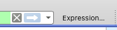
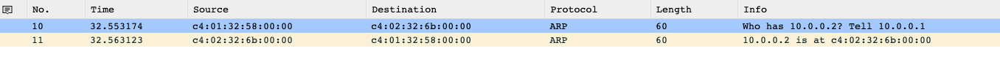
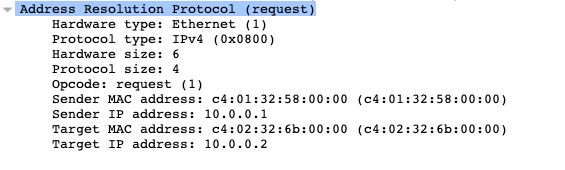
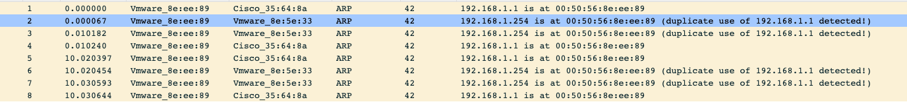
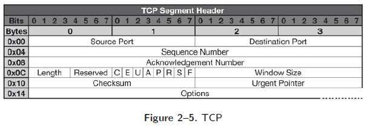
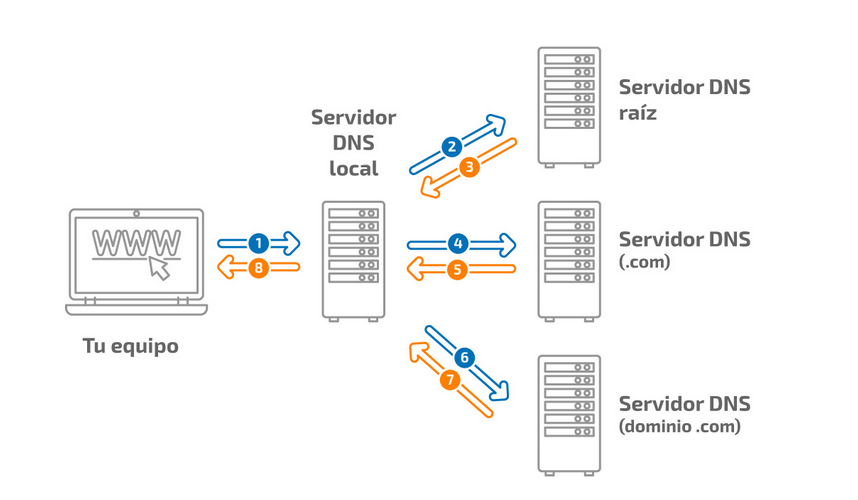

---

# Crear filtros en Wireshark

**Opción 1:** Barra de filtros — sintaxis directa con **autocompletar**

---

# Crear filtros en Wireshark

**Opción 2:** Botón **Expression** — selección guiada por protocolo y campo

---

# Crear filtros en Wireshark

**Opción 3:** Click derecho sobre un paquete o campo → *Apply as Filter*

---

# Crear filtros en Wireshark

---

# Filtros de lectura (Display Filters)

**Al abrir un PCAP** se puede aplicar un filtro de lectura:

Solo aparecen los paquetes que cumplen las condiciones

Útil para <strong>reducir PCAPs grandes</strong>

No destruye datos — se puede quitar el filtro

**Diferencia clave:**

`Capture Filter` = filtra durante la captura (BPF)

`Display Filter` = filtra la vista del archivo ya capturado

---

# Exportar objetos de Wireshark

**File → Export Objects → HTTP**

Wireshark puede **reconstituir y exportar** objetos HTTP:

Páginas HTML

Imágenes descargadas

Binarios / ejecutables

Documentos (PDF, Office...)

Se guardan para análisis forense posterior

---

# LogiCorp — Apertura del PCAP

**En el caso de LogiCorp:**

IT nos entrega el PCAP del firewall perimetral de las últimas 4 horas. Lo primero es orientarse sin perdernos en los miles de paquetes.

**Filtros iniciales aplicados:**

<code>dns</code> — aislamos todas las consultas de nombres

<code>ip.src == 10.10.1.45</code> — solo tráfico de DESKTOP-MK3

<code>tcp.port == 443 && ip.dst != 10.0.0.0/8</code> — HTTPS saliente

**Primer hallazgo:**

Al aislar DNS, aparecen consultas repetidas al mismo dominio desconocido — exactamente cada 60 segundos.

Pasamos al módulo de protocolos para entender qué estamos viendo.

---

# Un poquito de protocolos…

> *"Attackers bend and break protocols in order to smuggle covert data, sneak past firewalls, bypass authentication, and conduct widespread denial-of-service (DoS) attacks."*
>
> — Davidoff & Ham, 2012

---

# Capa de enlace IEEE 802.x — Trama

**Tamaño mínimo de trama:** 14 + 46 + 4 bytes (mecanismo anti-colisiones)

---

# Capa de enlace IEEE 802.x — Wireshark

---

# ARP — Address Resolution Protocol

**¿Para qué sirve ARP?**

Resolución de dirección IP → MAC en el mismo segmento LAN

Necesario antes de cualquier comunicación L2

**Flujo:**

A quiere hablar con 10.0.0.2 pero no sabe su MAC

A emite un ARP Request (broadcast)

10.0.0.2 responde con su MAC (ARP Reply unicast)

A almacena la entrada en su cache ARP

---

# ARP — En Wireshark

---

# Problemas de ARP

**ARP no es seguro:**

No valida autenticidad del emisor

Cualquiera puede responder a cualquier petición ARP

Todos los equipos actualizan su caché al recibir ARP

**ARP Spoofing / Poisoning:**

Un atacante envía ARP Replies falsos

Redirige tráfico hacia sí mismo → <strong>MITM</strong>

Permite capturar o modificar tráfico

**Detección en Wireshark:**

`arp.duplicate-address-detected` o múltiples MACs para la misma IP

---

# IPv4 vs IPv6

## IPv4

Direccionamiento de <strong>32 bits</strong>

~4.300 millones de direcciones

RFC 791

## IPv6

Direccionamiento de <strong>128 bits</strong>

340 undecillones de direcciones

RFC 2460, RFC 4291

---

# Cabecera de IPv4

**Campos clave:**

<strong>Versión</strong>: 4 (IPv4) o 6 (IPv6) — otro valor → descarte

<strong>Protocol</strong>: tipo de capa 4 encapsulada

ICMP: 1 | TCP: 6 | UDP: 17 (0x11)

<strong>TTL</strong>: saltos máximos antes del descarte

Windows: 128 | Linux: 64 | Routers: 255

<strong>ECN</strong>: notificación de congestión

00 = No ECN | 01/10 = ECN-Aware | 11 = Congestión

---

# Cabecera IPv4 — Campos adicionales

**Tamaño y calidad de servicio:**

<strong>IHL</strong>: longitud de cabecera en palabras de 32 bits

Mínimo: 5 (20 bytes) | Máximo: 15 (60 bytes)

<strong>DSCP/ToS</strong>: prioridad y clase de tráfico

VoIP, vídeo → valores elevados de DSCP

<strong>Total Length</strong>: tamaño total del paquete (cabecera + datos)

Máximo: 65 535 bytes

**Fragmentación e integridad:**

<strong>Identification</strong>: ID común a todos los fragmentos del mismo datagrama

<strong>Flags</strong>: control de fragmentación

DF (Don't Fragment) | MF (More Fragments)

<strong>Fragment Offset</strong>: posición del fragmento (múltiplo de 8 bytes)

<strong>Header Checksum</strong>: verificación de integridad solo de la cabecera

Recalculado en cada router (el TTL cambia)

---

# Fragmentación de IPv4

**¿Cuándo ocurre?**

Paquete mayor que el <strong>MTU</strong> del enlace

Máx IP: 64KB | Ethernet: 1500 bytes

**Control de fragmentación:**

<strong>ID</strong>: mismo valor en todos los fragmentos

<strong>Offset</strong>: posición del fragmento (múltiplo de 8)

<strong>Flag M</strong>: "More Fragments" — activo en todos salvo el último

**Forense:**

La fragmentación puede usarse para evadir IDS que solo inspeccionan el primer fragmento

---

# IPv6 — Ventajas

**Motivación:**

Direcciones IPv4 públicas agotadas desde ~2011

NAT y redes privadas son parches temporales

**Mejoras técnicas:**

Enrutamiento más sencillo (sin broadcast)

<strong>Seguridad nativa</strong> (IPSec integrado)

Cifrado del payload

Comprobación de integridad

Autenticación del origen

**Más mejoras:**

QoS mejorado (Flow Label)

Payloads mayores (jumbogramas)

Autoconfiguración SLAAC

Sin checksums en cabecera

**Reto forense:** Mayor opacidad si no se tiene visibilidad sobre el enrutamiento IPv6 interno

---

# TCP vs UDP

## TCP
## Transmission Control Protocol

<strong>Confiable</strong>

Con secuenciación y reordenación

Orientado a conexión (3-way handshake)

Control de flujo y congestión

Puertos 0–65535 | RFC 793

## UDP
## User Datagram Protocol

<strong>No confiable</strong>

Sin secuenciación

No orientado a conexión

Sin control de flujo

Puertos 0–65535 | RFC 768

---

# TCP vs UDP — Cabeceras

---

# Establecimiento de conexión TCP (3-Way Handshake)

---

# Fin de conexión TCP (4-Way Teardown)

---

# UDP — Características

**Protocolo ligero y rápido:**

Sobrecarga mínima de cabecera (8 bytes)

Sin control de flujo ni retransmisiones

Sin garantía de orden de llegada

**Protocolos basados en UDP:**

<strong>DNS</strong> — resolución de nombres

<strong>NTP</strong> — sincronización de tiempo

<strong>SNMP</strong> — monitorización

<strong>DHCP</strong> — configuración dinámica

<strong>QUIC/HTTP3</strong> — web moderno

**Cabecera UDP (8 bytes):**

Puerto origen | Puerto destino

Longitud total | Checksum

Diseñados en una era sin modelo de seguridad → son vectores de ataque habituales

---

# UDP — En Wireshark

**Tamaño mínimo:** 8 bytes (solo cabecera) — si vale 0 = jumbograma

---

# ICMP — Internet Control Message Protocol

**Propósito:**

Reportar errores <strong>no temporales</strong> de la red

Intercambiar información de control simple

**Casos de uso:**

Fragmentación necesaria pero DF=1

Puerto inalcanzable (destino no responde)

<strong>Ping</strong> (Echo Request / Echo Reply)

TTL Exceeded (traceroute)

**Habitual bloquearlo en redes corporativas:**

Dificulta el descubrimiento de la red

Anula PMTUD → puede generar problemas de red

**Forense:**

Los mensajes de error ICMP **incluyen parte del paquete original** que causó el error → revelan información de sesiones internas

---

# ICMP Echo Request / Reply (PING)

**Estructura:**

<strong>Mismo identificador</strong> en request y reply

Diferentes <strong>números de secuencia</strong> por envío

Permite controlar paquetes perdidos y latencia

**Uso malicioso:**

<strong>ICMP Tunneling</strong> — exfiltración de datos en el payload ICMP

Reconocimiento de red (ping sweep)

Fragmentación maliciosa (Ping of Death)

**Detección en Wireshark:**

Filtro: `icmp.type == 8` (request)

Payload ICMP anormalmente grande = sospechoso

---

# DNS — Domain Name System

**¿Qué hace DNS?**

Traduce nombres de dominio en direcciones IP

Jerarquía de servidores involucrados:

<strong>Resolutores</strong> (stub + recursive)

<strong>Raíz</strong> (13 grupos de root servers)

<strong>TLD</strong> (.com, .es, .org...)

<strong>Autoritativos</strong> (zona del dominio)

---

# DNS — Respuesta en Wireshark

**Secciones de la respuesta DNS:**

<strong>Question</strong>: el nombre consultado

<strong>Answer</strong>: registros que responden la consulta

<strong>Authority</strong>: servidores autoritativos del dominio

<strong>Additional</strong>: IPs de los autoritativos

**Forense DNS:**

DNS es el protocolo de exfiltración y C2 más usado — todo el tráfico interno pasa por el DNS corporativo

---

# DNS Records — Tipos

| Tipo | Función | Relevancia Forense |
|------|---------|-------------------|
| A | IPv4 del dominio | Resolución C2, phishing |
| AAAA | IPv6 del dominio | C2 sobre IPv6 |
| CNAME | Alias | Redirección encubierta |
| MX | Servidor de correo | SPAM, phishing |
| TXT | Texto libre | Exfiltración, verificación |
| PTR | Reverse DNS (IP→nombre) | Atribución |
| NS | Servidor autoritativo | Takeover de dominio |

---

# DNS — Variantes de transporte

**DNS clásico (UDP/53):**

Sin cifrado — visible en la red

Fácil de analizar en Wireshark

Fácil de bloquear o interceptar

**DNS sobre TLS (DoT / puerto 853):**

Tráfico cifrado TCP

Más fácil de bloquear (puerto único)

**DNS sobre HTTPS (DoH / puerto 443):**

Mezclado con tráfico HTTPS normal

<strong>Difícil de bloquear sin rompimiento TLS</strong>

Usado por malware moderno para evasión

**Reto forense 2025:**

Malware usa DoH (Cloudflare, Google) para ocultar resoluciones de C2

---

# LogiCorp — Anomalía DNS detectada

**En el caso de LogiCorp:**

Filtramos `dns` y ordenamos por nombre de dominio. Aparece `upd4te-cdn.net` con 240 consultas en 4 horas.

**Señales de alarma:**

Intervalo exacto de 60 segundos → <strong>beaconing</strong>

Dominio registrado hace 3 días → sospechoso

Sin tráfico web previo a ese dominio → no es legítimo

Responde siempre a la misma IP: <code>185.220.101.12</code>

**Filtro Wireshark:**

`dns.qry.name contains "upd4te"`

→ 240 resultados, todos desde `DESKTOP-MK3`

Regla práctica: si un dominio aparece con **periodicidad fija**, es C2 hasta que se demuestre lo contrario

---

# HTTP/S — HyperText Transfer Protocol

## HTTP (puerto 80)

Protocolo de texto claro

Uso muy reducido hoy en día

Visible directamente en Wireshark

## HTTPS (puerto 443)

HTTP sobre TLS/SSL — cifrado end-to-end

Requiere interceptación mediante proxy o SSLKEYLOGFILE

95%+ del tráfico web actual

**Vector muy común y difícil de bloquear:**

Navegación web legítima

APIs REST

Delivery de malware

Canales C2

Exfiltración de datos

Casi todos los campos HTTP son **manipulables** por el atacante

---

# HTTP/S — Códigos de respuesta

| Rango | Significado | Ejemplo forense |
|-------|------------|----------------|
| 1xx | Informativo | Poco común, ignorable |
| 2xx | Éxito | 200 OK — contenido servido |
| 3xx | Redirección | 302 → redirección a C2 |
| 4xx | Error cliente | 404 fichero no existe, 403 acceso denegado |
| 5xx | Error servidor | 500 = posible explotación |

**Truco forense:** Una ráfaga de 404 desde una IP = reconocimiento (fuzzing de rutas)

Una serie de 200 hacia URLs aleatorias = posible DGA / C2

---

# HTTP — Métodos

**Métodos comunes:**

<strong>GET</strong> — solicitar recurso (sin body)

<strong>POST</strong> — enviar datos al servidor

<strong>PUT</strong> — subir/actualizar recurso

<strong>DELETE</strong> — eliminar recurso

<strong>HEAD</strong> — solo cabeceras, sin cuerpo

**Relevancia forense:**

POST con body grande → posible exfiltración

PUT/DELETE inusuales → posible webshell

User-Agent sospechoso → herramienta de ataque

Muchos GET rápidos → fuzzing / scaneo

