---
# Wireshark - La herramienta esencial

<div class="cols">
<div>

**Wireshark**

<div class="list-item">Herramienta <strong>principal</strong> para análisis de red</div>
<div class="list-item"><strong>Open source</strong></div>
<div class="list-item">GUI completa e intuitiva</div>

**Características:**

<div class="list-item">[OK] Excelente parseo de protocolos</div>
<div class="list-item">[OK] Filtros potentes</div>
<div class="list-item">[OK] Búsqueda de cadenas de texto</div>
<div class="list-item">[OK] Exportación (archivos, objetos HTTP, descifrado)</div>

</div>
<div>

<div class="list-item">[OK] Estadísticas detalladas</div>
<div class="list-item">[OK] Datos expertos (Expert Info)</div>
<div class="list-item">[OK] Información sobre protocolos</div>
<div class="list-item">[OK] Análisis de conversaciones</div>
<div class="list-item">[OK] Seguimiento de streams (TCP, UDP, HTTP)</div>

<div class="highlight-box">

**Tip:**
Dominar Wireshark es fundamental para cualquier analista de red

</div>

</div>
</div>

---

# Filtros de lectura (Display Filters)

<div class="cols">
<div>

**Al abrir un PCAP** se puede aplicar un filtro de lectura:

<div class="list-item">Solo aparecen los paquetes que cumplen las condiciones</div>
<div class="list-item">Útil para <strong>reducir PCAPs grandes</strong></div>
<div class="list-item">No destruye datos — se puede quitar el filtro</div>
<div class="list-item">Muy potentes para buscar dentro del PCAP </div>
<div class="list-item">Permiten filtrar por campos internos del protocolo</div>

</div>

<div class="highlight-box">

**Diferencia clave:**
`Display Filter` = filtra la vista del archivo ya capturado
`Capture Filter` = filtra durante la captura (BPF)
Se puede reducir un PCAP enorme, usando tcpdump o tshark para generar un subset antes de abrirlo en Wireshark. 
Generad una nueva copia "reducida" no sobreescribais el original. 

</div>
</div>
</div>
<div>

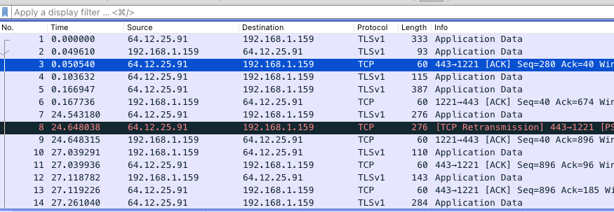

</div>


---

# Crear filtros en Wireshark
<div class="warn-box">
Solo veremos una de las tres opciones. Las otras dos se encuentran en los apéndices
</div>

<div class="highlight-box">

**Opción 1:** Barra de filtros — sintaxis directa con **autocompletar**

</div>

<div class="cols">
<div>

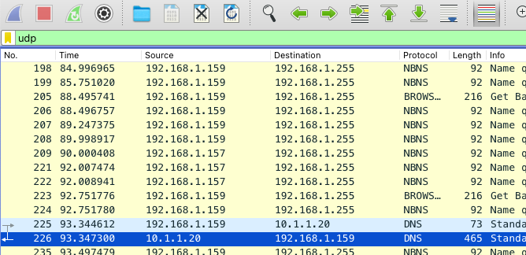
<div class="center-content">Barra de filtros de Wireshark</div>

</div>
<div>

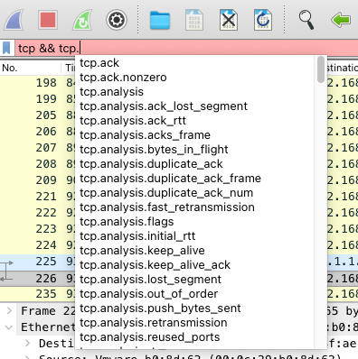
<div class="center-content">Autocompletado y sugerencias</div>
</div>
</div>

---

# Exportar objetos de Wireshark

<div class="cols">
<div>
      
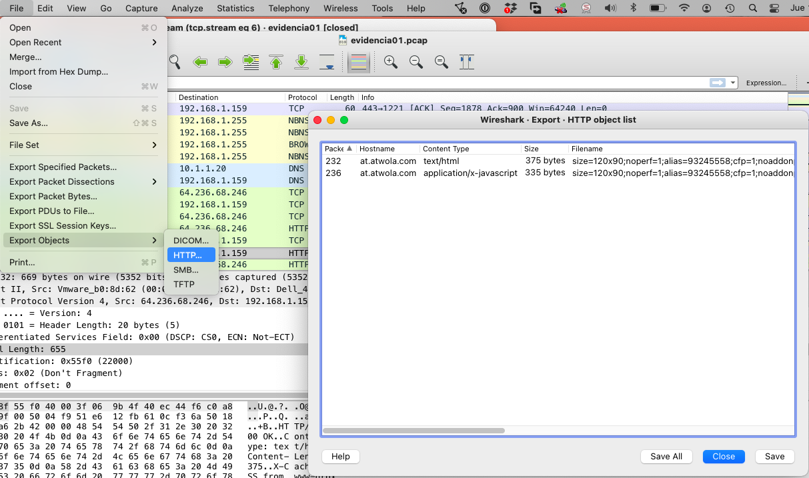

</div>

<div>
      
**File → Export Objects**
Wireshark puede reconstituir y exportar objetos:

<div class="list-item">HTTP: Reconstituye páginas, imágenes, documentos, binarios</div>
<div class="list-item">SMTP / POP3 / IMAP (IMF): Extrae correos completos y adjuntos</div>
<div class="list-item">FTP / TFTP: Archivos transferidos en sesiones FTP/TFTP</div>
<div class="list-item">Otros (SMB, CIFS…): Archivos compartidos y artefactos de red</div>


<div class="highlight-box">
      
**Tip**: Genera copias de los objetos exportados, nunca modifiques el PCAP original. Esto permite análisis forense posterior y evita corromper evidencia.

</div>

</div>

---

# Apertura de un PCAP

<div class="warn-box">

**En caso de intervención:**
Cuando hay sospecha de un incidente y se analiza un PCAP, hay mucho ruido. 
Lo primero es orientarse sin perdernos en los miles de paquetes.

</div>

<div class="cols">
<div>

**Filtros iniciales aplicados:**

<div class="list-item"><code>dns</code> — aislamos todas las consultas de nombres</div>
<div class="list-item"><code>ip.src == 10.10.1.45</code> — solo tráfico de un host</div>
<div class="list-item"><code>tcp.port == 443 && ip.dst != 10.0.0.0/8</code> — HTTPS saliente</div>
<div class="list-item"><code>dns.qry.name.length > 20 && dns.flags.response == 0</code> DNS sospechosos DGA</div>

</div>
<div>

<div class="highlight-box">

**Caso hipotético:**

Al analizar DNS, aparecen consultas repetidas a un mismo dominio — exactamente cada 60 segundos.

</div>

¿Qué técnica de C2 puede estar usando esto?

</div>

<div class="highlight-box">

Abrir → Investigar → Filtrar → Limpiar → Abrir de nuevo

</div>

</div>

---

# Un poquito de protocolos…

<div class="center-content">

> *"Attackers bend and break protocols in order to smuggle covert data, sneak past firewalls, bypass authentication, and conduct widespread denial-of-service (DoS) attacks."*
>
> — Davidoff & Ham, 2012

</div>

---

# ARP — Address Resolution Protocol

<div class="img-text">
<div>

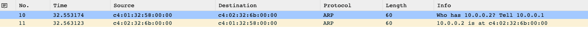

</div>
<div>

**¿Para qué sirve ARP?**

<div class="list-item">Resolución de dirección IP → MAC en el mismo segmento LAN</div>
<div class="list-item">Necesario antes de cualquier comunicación L2</div>

**Flujo:**

<div class="list-item-sub">A quiere hablar con 10.0.0.2 pero no sabe su MAC</div>
<div class="list-item-sub">A emite un ARP Request (broadcast)</div>
<div class="list-item-sub">10.0.0.2 responde con su MAC (ARP Reply unicast)</div>
<div class="list-item-sub">A almacena la entrada en su cache ARP</div>

</div>
</div>

---

# ARP — En Wireshark

<div class="img-text">
<div>

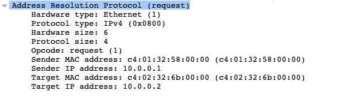

</div>
<div>

**Flujo observable en Wireshark:**

<div class="list-item"><strong>Request</strong>: broadcast — "¿Quién tiene 10.0.0.2?"</div>
<div class="list-item"><strong>Reply</strong>: unicast — "10.0.0.2 está en AA:BB:CC:..."</div>

<div class="highlight-box">

**Señal de alerta:**

Múltiples IPs anunciando la misma MAC — o la misma IP con MACs distintas — es la firma del ARP spoofing

`arp.duplicate-address-detected`

</div>

</div>
</div>

---

# Problemas de ARP

<div class="cols">
<div>

<div class="warn-box">

**ARP no es seguro:**

<div class="list-item">No valida autenticidad del emisor</div>
<div class="list-item">Cualquiera puede responder a cualquier petición ARP</div>
<div class="list-item">Todos los equipos actualizan su caché al recibir ARP</div>

</div>

**ARP Spoofing / Poisoning:**

<div class="list-item">Un atacante envía ARP Replies falsos</div>
<div class="list-item">Redirige tráfico hacia sí mismo → <strong>MITM</strong></div>
<div class="list-item">Permite capturar o modificar tráfico</div>

</div>
<div>

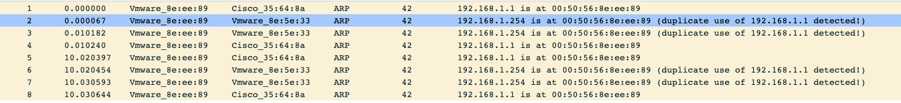

<div class="highlight-box">

**Detección en Wireshark:**

`arp.duplicate-address-detected` o múltiples MACs para la misma IP

</div>

</div>
</div>

---

# IPv4 vs IPv6

<div class="cols">
<div>

## IPv4

<div class="list-item">Direccionamiento de <strong>32 bits</strong></div>
<div class="list-item">~4.300 millones de direcciones</div>
<div class="list-item">RFC 791</div>

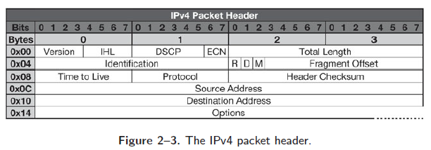

</div>
<div>

## IPv6

<div class="list-item">Direccionamiento de <strong>128 bits</strong></div>
<div class="list-item">340 undecillones de direcciones</div>
<div class="list-item">RFC 2460, RFC 4291</div>

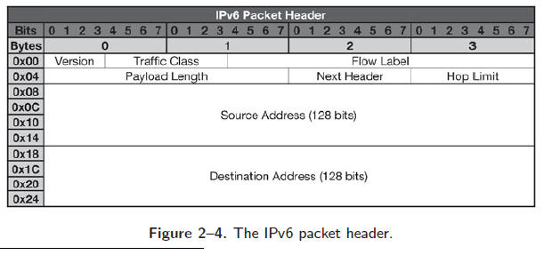

</div>
</div>

---

# Fragmentación de IPv4

<div class="cols">
<div>

**¿Cuándo ocurre?**

<div class="list-item">Paquete mayor que el <strong>MTU</strong> del enlace</div>
<div class="list-item-sub">Máx IP: 64KB | Ethernet: 1500 bytes</div>

**Control de fragmentación:**

<div class="list-item"><strong>ID</strong>: mismo valor en todos los fragmentos</div>
<div class="list-item"><strong>Offset</strong>: posición del fragmento (múltiplo de 8)</div>
<div class="list-item"><strong>Flag M</strong>: "More Fragments" — activo en todos salvo el último</div>

</div>
<div>


<div class="highlight-box">

**Forense:**

La fragmentación puede usarse para evadir IDS que solo inspeccionan el primer fragmento

</div>

</div>
</div>

---

# IPv6 — Ventajas

<div class="cols">
<div>

**Motivación:**

<div class="list-item">Direcciones IPv4 públicas agotadas desde ~2011</div>
<div class="list-item">NAT y redes privadas son parches temporales</div>

**Mejoras técnicas:**

<div class="list-item">Enrutamiento más sencillo (sin broadcast)</div>
<div class="list-item"><strong>Seguridad nativa</strong> (IPSec integrado)</div>
<div class="list-item-sub">Cifrado del payload</div>
<div class="list-item-sub">Comprobación de integridad</div>
<div class="list-item-sub">Autenticación del origen</div>

</div>
<div>

<div class="highlight-box">

**Más mejoras:**

<div class="list-item">QoS mejorado (Flow Label)</div>
<div class="list-item">Payloads mayores (jumbogramas)</div>
<div class="list-item">Autoconfiguración SLAAC</div>
<div class="list-item">Sin checksums en cabecera</div>

</div>

<div class="warn-box">

**Reto forense:** Mayor opacidad si no se tiene visibilidad sobre el enrutamiento IPv6 interno

</div>

</div>
</div>

---

# TCP vs UDP

<div class="cols">
<div>

## TCP
## Transmission Control Protocol

<div class="list-item"><strong>Confiable</strong></div>
<div class="list-item">Con secuenciación y reordenación</div>
<div class="list-item">Orientado a conexión (3-way handshake)</div>
<div class="list-item">Control de flujo y congestión</div>
<div class="list-item">Puertos 0–65535 | RFC 793</div>

</div>
<div>

## UDP
## User Datagram Protocol

<div class="list-item"><strong>No confiable</strong></div>
<div class="list-item">Sin secuenciación</div>
<div class="list-item">No orientado a conexión</div>
<div class="list-item">Sin control de flujo</div>
<div class="list-item">Puertos 0–65535 | RFC 768</div>

</div>
</div>

---

# TCP 3-Way Handshake — Valor Forense

<div class="cols">
<div>

**¿Por qué importa al forense?**

<div class="list-item"><strong>SYN masivos sin ACK de respuesta</strong> → escaneo de puertos (Nmap SYN scan)</div>
<div class="list-item"><strong>Handshake incompleto repetido</strong> → stealth scan o SYN flood (DoS)</div>
<div class="list-item"><strong>SYN-ACK sin SYN previo en el PCAP</strong> → captura iniciada a mitad de sesión</div>
<div class="list-item"><strong>RST en respuesta al SYN</strong> → puerto cerrado — el atacante mapea servicios</div>

</div>
<div>

<div class="highlight-box">

**Filtros clave:**

```wireshark
# Solo paquetes SYN (inicio de conexión)
tcp.flags.syn == 1 && tcp.flags.ack == 0

# Detectar SYN scan (Nmap)
tcp.flags == 0x002

# Handshakes con problemas
tcp.analysis.flags
```

</div>

<div class="warn-box">

Muchos SYN hacia distintos puertos desde la misma IP = reconocimiento activo

</div>

</div>
</div>

---

# TCP 4-Way Teardown — Valor Forense

<div class="cols">
<div>

**¿Por qué importa al forense?**

<div class="list-item"><strong>RST inesperado</strong> → conexión cortada abruptamente por herramienta, IDS o atacante</div>
<div class="list-item"><strong>Ráfaga de RST</strong> → escaneo automatizado detectado por el servidor</div>
<div class="list-item"><strong>FIN sin datos previos</strong> → sesión sospechosamente corta</div>
<div class="list-item"><strong>Conexión larga sin teardown</strong> → C2 persistente o backdoor activo</div>
<div class="list-item"><strong>Half-close (un solo FIN)</strong> → canal asimétrico, posible exfiltración lenta</div>

</div>
<div>

<div class="highlight-box">

**Filtros clave:**

```wireshark
# Resets anómalos
tcp.flags.reset == 1

# RST en lugar de FIN
tcp.flags == 0x004

# Sesiones de larga duración
tcp.time_relative > 300
```

</div>

<div class="warn-box">

Muchos RST hacia el mismo host = escaneo activo o herramienta de ataque detectada

</div>

</div>
</div>

---

# UDP — Características

<div class="cols">
<div>

**Protocolo ligero y rápido:**

<div class="list-item">Sobrecarga mínima de cabecera (8 bytes)</div>
<div class="list-item">Sin control de flujo ni retransmisiones</div>
<div class="list-item">Sin garantía de orden de llegada</div>

**Protocolos basados en UDP:**

<div class="list-item"><strong>DNS</strong> — resolución de nombres</div>
<div class="list-item"><strong>NTP</strong> — sincronización de tiempo</div>
<div class="list-item"><strong>SNMP</strong> — monitorización</div>
<div class="list-item"><strong>DHCP</strong> — configuración dinámica</div>
<div class="list-item"><strong>QUIC/HTTP3</strong> — web moderno</div>

</div>
<div>

<div class="highlight-box">

**Cabecera UDP (8 bytes):**

Puerto origen | Puerto destino

Longitud total | Checksum

</div>

<div class="warn-box">

Diseñados en una era sin modelo de seguridad → son vectores de ataque habituales

</div>

</div>
</div>

---

# ICMP — Internet Control Message Protocol

<div class="cols">
<div>

**Propósito:**

<div class="list-item">Reportar errores <strong>no temporales</strong> de la red</div>
<div class="list-item">Intercambiar información de control simple</div>

**Casos de uso:**

<div class="list-item">Fragmentación necesaria pero DF=1</div>
<div class="list-item">Puerto inalcanzable (destino no responde)</div>
<div class="list-item"><strong>Ping</strong> (Echo Request / Echo Reply)</div>
<div class="list-item">TTL Exceeded (traceroute)</div>

</div>
<div>

<div class="warn-box">

**Habitual bloquearlo en redes corporativas:**

<div class="list-item">Dificulta el descubrimiento de la red</div>
<div class="list-item">Anula PMTUD → puede generar problemas de red</div>

</div>

<div class="highlight-box">

**Forense:**

Los mensajes de error ICMP **incluyen parte del paquete original** que causó el error → revelan información de sesiones internas

</div>

</div>
</div>

---

# ICMP Echo Request / Reply (PING)

<div class="cols">
<div>

**Estructura:**

<div class="list-item"><strong>Mismo identificador</strong> en request y reply</div>
<div class="list-item">Diferentes <strong>números de secuencia</strong> por envío</div>
<div class="list-item">Permite controlar paquetes perdidos y latencia</div>

**Uso malicioso:**

<div class="list-item"><strong>ICMP Tunneling</strong> — exfiltración de datos en el payload ICMP</div>
<div class="list-item">Reconocimiento de red (ping sweep)</div>
<div class="list-item">Fragmentación maliciosa (Ping of Death)</div>

</div>
<div>

<div class="highlight-box">

**Detección en Wireshark:**

Filtro: `icmp.type == 8` (request)

Payload ICMP anormalmente grande = sospechoso

</div>

</div>
</div>

---

# DNS — Domain Name System

<div class="text-img">
<div>

**¿Qué hace DNS?**

<div class="list-item">Traduce nombres de dominio en direcciones IP</div>
<div class="list-item">Jerarquía de servidores involucrados:</div>
<div class="list-item-sub"><strong>Resolutores</strong> (stub + recursive)</div>
<div class="list-item-sub"><strong>Raíz</strong> (13 grupos de root servers)</div>
<div class="list-item-sub"><strong>TLD</strong> (.com, .es, .org...)</div>
<div class="list-item-sub"><strong>Autoritativos</strong> (zona del dominio)</div>

</div>
<div>

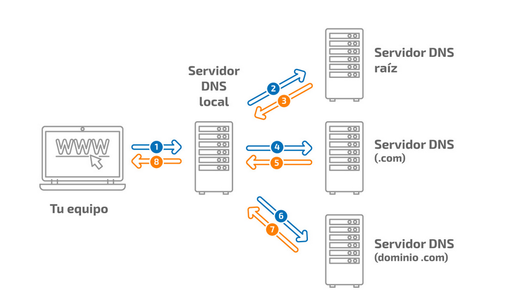

</div>
</div>

---

# DNS — Respuesta en Wireshark

<div class="img-text">
<div>

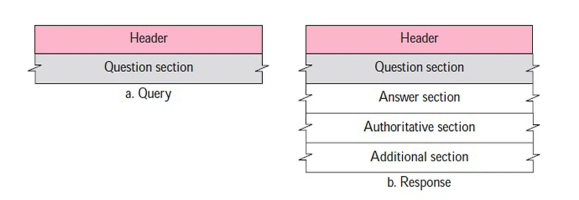

</div>
<div>

**Secciones de la respuesta DNS:**

<div class="list-item"><strong>Question</strong>: el nombre consultado</div>
<div class="list-item"><strong>Answer</strong>: registros que responden la consulta</div>
<div class="list-item"><strong>Authority</strong>: servidores autoritativos del dominio</div>
<div class="list-item"><strong>Additional</strong>: IPs de los autoritativos</div>

<div class="highlight-box">

**Forense DNS:**

DNS es el protocolo de exfiltración y C2 más usado — todo el tráfico interno pasa por el DNS corporativo

</div>

</div>
</div>

---

# DNS Records — Tipos

| Tipo | Función | Relevancia Forense |
|------|---------|-------------------|
| A | IPv4 del dominio | Resolución C2, phishing |
| AAAA | IPv6 del dominio | C2 sobre IPv6 |
| CNAME | Alias | Redirección encubierta |
| MX | Servidor de correo | SPAM, phishing |
| TXT | Texto libre | Exfiltración, verificación |
| PTR | Reverse DNS (IP→nombre) | Atribución |
| NS | Servidor autoritativo | Takeover de dominio |

---

# DNS — Variantes de transporte

<div class="cols">
<div>

**DNS clásico (UDP/53):**

<div class="list-item">Sin cifrado — visible en la red</div>
<div class="list-item">Fácil de analizar en Wireshark</div>
<div class="list-item">Fácil de bloquear o interceptar</div>

**DNS sobre TLS (DoT / puerto 853):**

<div class="list-item">Tráfico cifrado TCP</div>
<div class="list-item">Más fácil de bloquear (puerto único)</div>

</div>
<div>

**DNS sobre HTTPS (DoH / puerto 443):**

<div class="list-item">Mezclado con tráfico HTTPS normal</div>
<div class="list-item"><strong>Difícil de bloquear sin ruptura de TLS</strong></div>
<div class="list-item">Usado por malware moderno para evasión</div>

<div class="warn-box">

**Reto forense 2025:**

Malware usa DoH (Cloudflare, Google) para ocultar resoluciones de C2

</div>

</div>
</div>

---

# Detectar anomalías DNS: Beaconing

<div class="warn-box">

Algunos ataques C2 usan consultas DNS periódicas hacia dominios controlados por el atacante.

</div>

<div class="cols">
<div>

**Señales de alarma:**

<div class="list-item">Intervalo exacto de 60 segundos → <strong>beaconing</strong></div>
<div class="list-item">Dominio recién registrado → sospechoso</div>
<div class="list-item">Tráfico inesperado desde hosts internos</div>
<div class="list-item">Responde siempre la misma IP</div>

</div>
<div>

<div class="highlight-box">

**Filtro Wireshark:**

`dns.qry.name contains "<nombre_del_dominio>"`


</div>

<div class="warn-box">

Regla práctica: si un dominio aparece con **periodicidad fija**, es C2 hasta que se demuestre lo contrario

</div>

</div>
</div>

---

# DHCP — Dynamic Host Configuration Protocol

<div class="cols">
<div>

**4 pasos: DISCOVER → OFFER → REQUEST → ACK**

```
Cliente                    Servidor DHCP
  │                             │
  │── DHCPDISCOVER (broadcast) ─►│
  │                             │
  │◄─── DHCPOFFER (unicast) ────│
  │                             │
  │── DHCPREQUEST (broadcast) ──►│
  │                             │
  │◄───── DHCPACK (unicast) ────│
```

**Transporte:** UDP puerto **67** (servidor) / **68** (cliente)

**Wireshark:** `bootp` *(v1.x)* o `dhcp` *(v2.6+)*

</div>
<div>

**Campos clave del paquete:**

<div class="list-item"><code>chaddr</code> — MAC del cliente (hardware address)</div>
<div class="list-item"><code>xid</code> — Transaction ID: vincula DISCOVER ↔ ACK</div>
<div class="list-item"><code>yiaddr</code> — IP ofrecida/asignada al cliente</div>
<div class="list-item"><code>siaddr</code> — IP del servidor DHCP</div>
<div class="list-item"><code>options</code> — Opciones extendidas (hostname, lease, fingerprint…)</div>

<div class="highlight-box">

El `xid` permite reconstruir **toda la negociación DORA** como una única transacción en el PCAP

</div>

</div>
</div>

---

# DHCP — Opciones con Valor Forense

<div class="cols">
<div>

| Opción | Nombre | Valor forense |
|--------|--------|---------------|
| **12** | Hostname | Nombre del equipo en la red |
| **50** | Requested IP | IP que el cliente quiere conservar |
| **51** | Lease Time | Duración de la asignación |
| **53** | Message Type | DISCOVER / OFFER / REQUEST / ACK |
| **55** | Parameter Request List | **Fingerprint del OS/dispositivo** |
| **60** | Vendor Class ID | Tipo de cliente (`MSFT 5.0`, `android-dhcp-13`) |
| **61** | Client Identifier | UUID del cliente (alternativa a la MAC) |

</div>
<div>

**Extracción con tshark:**

```bash
# Todas las asignaciones (DHCPACK)
tshark -r cap.pcap -Y "dhcp.option.dhcp == 5" \
  -T fields \
  -e dhcp.ip.your \
  -e dhcp.hw.mac_addr \
  -e dhcp.option.hostname

# Vendor Class + fingerprint (Option 55 y 60)
tshark -r cap.pcap -Y "dhcp" \
  -T fields \
  -e dhcp.hw.mac_addr \
  -e dhcp.option.vendor_class_id \
  -e dhcp.option.param_request_list
```

</div>
</div>

---

# DHCP — Atribución: De la IP al Usuario

<div class="cols">
<div>

**El problema central del forense de red:**

<div class="list-item">Los PCAPs y logs solo registran <strong>IPs</strong></div>
<div class="list-item">Las IPs dinámicas cambian con cada lease</div>
<div class="list-item">La misma IP puede haber sido de 3 equipos distintos en un día</div>

**Cadena de atribución completa:**

<div class="highlight-box">

```
IP + timestamp exacto
      ↓ DHCP logs (lease activo en ese momento)
   MAC address
      ↓ DHCP Option 12 / DNS inverso
     Hostname
      ↓ Active Directory (dNSHostName → samAccountName)
  Cuenta de usuario
      ↓ RRHH / inventario HW
   Persona física
```

</div>

</div>
<div>

**Puntos críticos:**

<div class="list-item"><strong>Precisión temporal</strong> — necesitas el timestamp exacto y el lease activo en ese momento</div>
<div class="list-item-sub">Un lease de 8h puede cubrir varios turnos de trabajo</div>

<div class="list-item"><strong>MAC spoofing</strong> — un atacante puede clonar la MAC de otro equipo</div>
<div class="list-item-sub">Cruzar con tabla CAM del switch y logs 802.1X</div>

<div class="list-item"><strong>Dispositivos compartidos</strong> — impresoras, puntos de acceso, VMs</div>
<div class="list-item-sub">Su MAC no identifica a un usuario individual</div>

<div class="warn-box">

Sin logs DHCP históricos con timestamps, la atribución IP→usuario es **imposible**

</div>

</div>
</div>

---

# DHCP — Fingerprinting de Dispositivos

<div class="cols">
<div>

**¿Qué es el DHCP fingerprinting?**

<div class="list-item">Cada OS solicita DHCP de forma diferente</div>
<div class="list-item">La <strong>Option 55</strong> (Parameter Request List) actúa como huella digital</div>
<div class="list-item">Bases de datos como <strong>Fingerbank</strong> identifican el OS por esta lista</div>

**Ejemplos de PRL (Option 55) conocidas:**

| PRL | OS identificado |
|-----|-----------------|
| `1,3,6,15,31,33,43,44,46,47,119,121,249,252` | Windows 10/11 |
| `1,121,3,6,15,119,252` | macOS |
| `1,3,6,15,119,121` | Linux (Ubuntu/NetworkManager) |
| `1,3,6,15,26,28,51,58,59,43` | Android |
| `1,121,3,6,15,119,252,95,44` | iOS |

</div>
<div>

**Valor forense:**

<div class="list-item">Detectar un dispositivo <strong>no autorizado</strong> en la red</div>
<div class="list-item-sub">Ej: Raspberry Pi o dispositivo IoT sin inventariar</div>

<div class="list-item">Detectar <strong>inconsistencias sospechosas</strong></div>
<div class="list-item-sub">Hostname de Windows con PRL de Linux → posible VM o suplantación</div>
<div class="list-item-sub">Vendor Class `android-dhcp-13` con hostname `DESKTOP-XYZ` → incongruencia</div>

<div class="list-item">Identificar dispositivos aunque cambien de IP o MAC</div>

<div class="highlight-box">

**Herramientas:** `fingerbank.org` · Zeek (`dhcp.log`) · Arkime · `nmap --script dhcp-discover`

</div>

</div>
</div>

---

# DHCP — Actividad Maliciosa y Detección

<div class="cols">
<div>

## Rogue DHCP Server

<div class="list-item">El atacante levanta su propio servidor DHCP en la LAN</div>
<div class="list-item">Asigna su propia IP como <strong>default gateway o DNS</strong></div>
<div class="list-item">Obtiene posición de <strong>Man-in-the-Middle</strong> sin ARP spoofing</div>

<div class="warn-box">

Indicador: dos `DHCPOFFER` con `siaddr` distintos respondiendo al mismo `xid`

</div>

## DHCP Starvation

<div class="list-item">El atacante inunda el servidor con `DHCPDISCOVER` usando MACs falsas</div>
<div class="list-item">Agota el pool de IPs → <strong>Denegación de Servicio</strong> en la LAN</div>
<div class="list-item">Preludio habitual antes de lanzar un Rogue DHCP</div>

<div class="warn-box">

Indicador: cientos de `DHCPDISCOVER` con `chaddr` distintos en pocos segundos

</div>

</div>
<div>

## Detección en Wireshark

```bash
# Ver todos los servidores que responden (Rogue DHCP)
bootp.option.dhcp == 2        # filtra DHCPOFFER
# Agrupar por dhcp.ip.server → ¿más de uno?

# DHCP Starvation: muchos DISCOVER rápidos
bootp.option.dhcp == 1        # DHCPDISCOVER
# Statistics → Conversations → ver ratio MACs/tiempo

# DHCPNAK: servidor rechaza la petición
bootp.option.dhcp == 6        # DHCPNAK
```

<div class="highlight-box">

**Regla de detección:**

Un equipo legítimo hace DORA **una sola vez** al conectarse. Ver **decenas de DISCOVER desde la misma IP** en segundos es indicador de herramienta de ataque activa (`yersinia`, `DHCPig`)

</div>

</div>
</div>

---

# HTTP/S — HyperText Transfer Protocol

<div class="cols">
<div>

## HTTP (puerto 80)

<div class="list-item">Protocolo de texto claro</div>
<div class="list-item">Uso muy reducido hoy en día</div>
<div class="list-item">Visible directamente en Wireshark</div>

## HTTPS (puerto 443)

<div class="list-item">HTTP sobre TLS/SSL — cifrado end-to-end</div>
<div class="list-item">Requiere interceptación mediante proxy o SSLKEYLOGFILE</div>
<div class="list-item">95%+ del tráfico web actual</div>

</div>
<div>

<div class="highlight-box">

**Vector muy común y difícil de bloquear:**

<div class="list-item">Navegación web legítima</div>
<div class="list-item">APIs REST</div>
<div class="list-item">Delivery de malware</div>
<div class="list-item">Canales C2</div>
<div class="list-item">Exfiltración de datos</div>

</div>

<div class="warn-box">

Casi todos los campos HTTP son **manipulables** por el atacante

</div>

</div>
</div>

---

# HTTP/S — Códigos de respuesta

| Rango | Significado | Ejemplo forense |
|-------|------------|----------------|
| 1xx | Informativo | Poco común, ignorable |
| 2xx | Éxito | 200 OK — contenido servido |
| 3xx | Redirección | 302 → redirección a C2 |
| 4xx | Error cliente | 404 fichero no existe, 403 acceso denegado |
| 5xx | Error servidor | 500 = posible explotación |

<div class="highlight-box">

**Truco forense:** Una ráfaga de 404 desde una IP = reconocimiento (fuzzing de rutas)

Una serie de 200 hacia URLs aleatorias = posible DGA / C2

</div>

---

# HTTP — Métodos

<div class="cols">
<div>

**Métodos comunes:**

<div class="list-item"><strong>GET</strong> — solicitar recurso (sin body)</div>
<div class="list-item"><strong>POST</strong> — enviar datos al servidor</div>
<div class="list-item"><strong>PUT</strong> — subir/actualizar recurso</div>
<div class="list-item"><strong>DELETE</strong> — eliminar recurso</div>
<div class="list-item"><strong>HEAD</strong> — solo cabeceras, sin cuerpo</div>

</div>
<div>

<div class="highlight-box">

**Relevancia forense:**

<div class="list-item">POST con body grande → posible exfiltración</div>
<div class="list-item">PUT/DELETE inusuales → posible webshell</div>
<div class="list-item">User-Agent sospechoso → herramienta de ataque</div>
<div class="list-item">Muchos GET rápidos → fuzzing / scaneo</div>

</div>

</div>
</div>

---

# FTP y SMB — Protocolos con Alto Valor Forense

<div class="cols">
<div>

## FTP — Canal de control cleartext

<div class="list-item">Puerto <strong>21/tcp</strong> (comandos) + <strong>20/tcp</strong> o efímero (datos)</div>
<div class="list-item">Comandos en texto claro en el canal de control</div>
<div class="list-item"><code>STOR</code> = upload hacia el servidor · <code>RETR</code> = descarga</div>

```bash
# Filtros Wireshark
ftp                             # canal de control
ftp-data                        # transferencia de ficheros
ftp.request.command == "STOR"   # uploads (exfiltración)
```

</div>
<div>

## SMB — Compartición de ficheros Windows

<div class="list-item">Puerto <strong>445/tcp</strong> — SMB2/SMB3</div>
<div class="list-item">Shares admin (<code>C$</code>, <code>admin$</code>, <code>IPC$</code>) = movimiento lateral + exfil</div>
<div class="list-item">SMB3 cifra el payload → solo metadatos visibles sin clave</div>

```bash
# Write hacia un share = upload
smb2.cmd == 9                     # SMB2 Write
smb2.filename contains "C$"
smb2.filename contains "admin$"
```

<div class="warn-box">

FTP a IPs externas desconocidas · SMB fuera de horario · Volumen bytes\_dst >> normal

</div>

</div>
</div>
