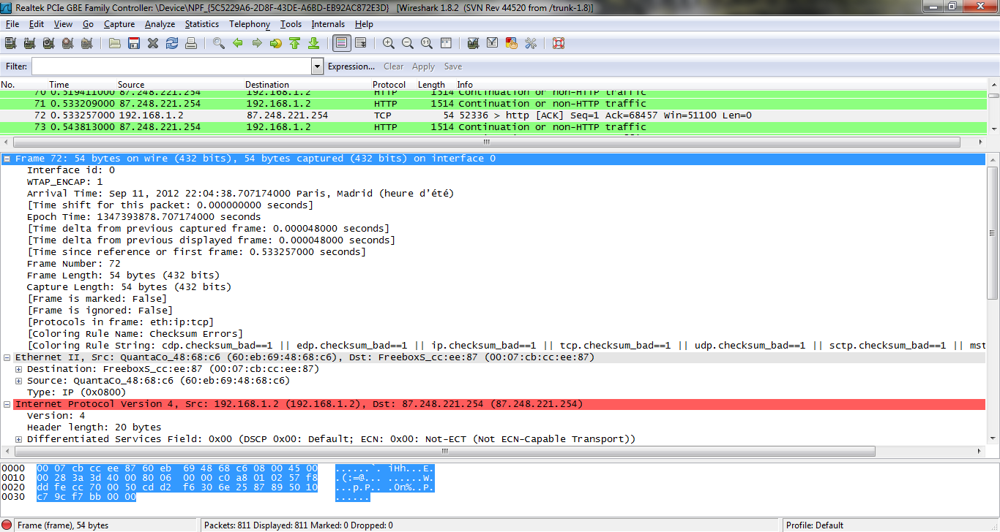
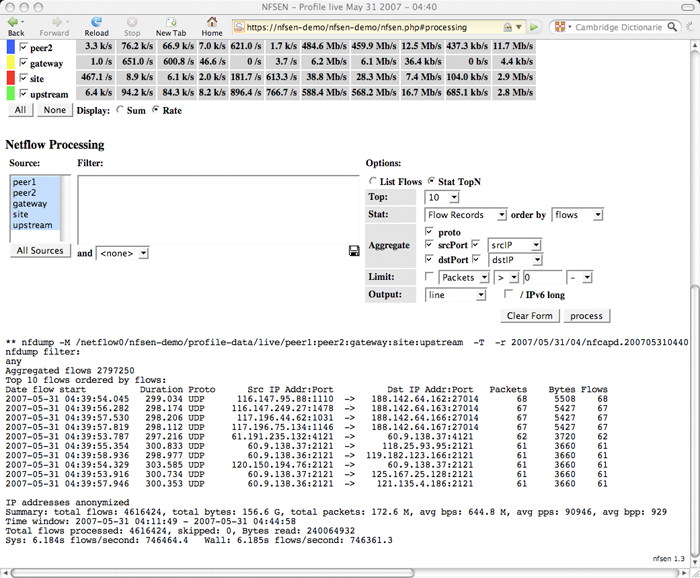
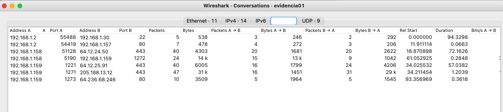
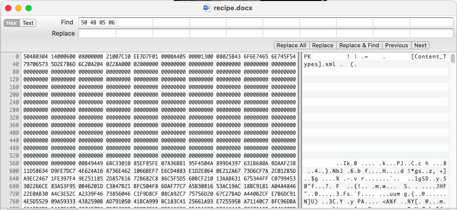
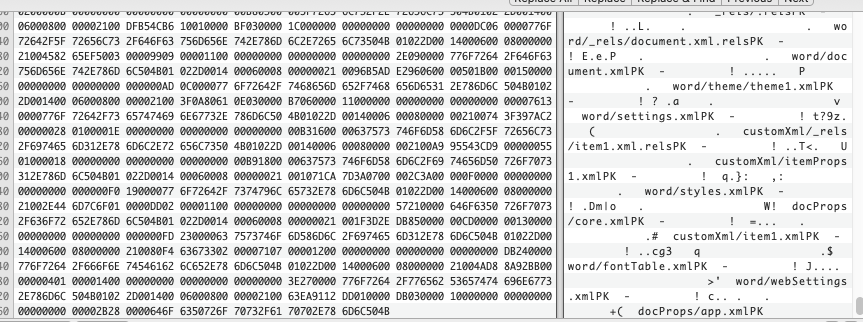

---


# Descifrado de TLS 1.3 en Wireshark

<div class="cols">
<div>

**El problema con TLS 1.3:**

<div class="list-item">TLS 1.2 → se podía usar la clave privada del servidor</div>
<div class="list-item">TLS 1.3 → <strong>Perfect Forward Secrecy obligatorio</strong></div>
<div class="list-item-sub">Cada sesión tiene claves efímeras distintas</div>
<div class="list-item-sub">La clave privada del servidor ya no permite descifrar sesiones pasadas</div>

**Solución: `SSLKEYLOGFILE`**

<div class="list-item">El navegador/app exporta las <em>session keys</em></div>
<div class="list-item">Wireshark las usa para descifrar en tiempo real</div>

</div>
<div>

```bash
# Linux / Mac
export SSLKEYLOGFILE=~/tls_keys.log

# Windows (permanente)
setx SSLKEYLOGFILE C:\tls_keys.log

# Wireshark:
# Edit → Preferences → Protocols
#   → TLS → Pre-Master-Secret log file
```

<div class="warn-box">

Solo funciona si **controlas el endpoint** que genera el tráfico

</div>

</div>
</div>

---

# Forense de red

<div class="center-content">

## Análisis Forense de Red

**La ciencia de reconstruir lo que ocurrió en la red**

</div>

---

# Análisis Forense de Red — Definición

<div class="cols">
<div>

**¿Qué es?**

<div class="list-item">El arte de <strong>reunir evidencias</strong> digitales en la escena de un crimen de red</div>
<div class="list-item">Monitorización y análisis del tráfico para:</div>
<div class="list-item-sub">Reunir información e indicios</div>
<div class="list-item-sub">Obtener pruebas con <strong>validez legal</strong></div>
<div class="list-item-sub">Detectar intrusos y actividad maliciosa</div>

**Características:**

<div class="list-item">Maneja información <strong>dinámica y muy volátil</strong></div>
<div class="list-item">Fuertemente dependiente de la <strong>calidad y cantidad</strong> de datos disponibles</div>
<div class="list-item">Requiere formación técnica <strong>y</strong> conocimiento del entorno</div>

</div>
<div>

<div class="highlight-box">

**Objetivo final:**

Reconstruir las acciones del atacante con suficiente detalle para:

<div class="list-item">Entender el vector de ataque</div>
<div class="list-item">Determinar el alcance del daño</div>
<div class="list-item">Atribuir la actividad</div>
<div class="list-item">Sustentar una acusación legal</div>

</div>

</div>
</div>

---

# Marco Legal — ¿Puedo capturar este tráfico?

<div class="cols">
<div>

## Principio fundamental

<div class="warn-box">

Capturar tráfico de red **sin autorización** es ilegal en la mayoría de jurisdicciones, incluso siendo el administrador de la red

</div>

**¿Cuándo es legal?**

<div class="list-item">Eres el <strong>propietario de la red</strong> o actúas con mandato explícito</div>
<div class="list-item">Existe una <strong>política de uso aceptable</strong> firmada por los empleados</div>
<div class="list-item">En España: <strong>autorización escrita</strong> de la dirección antes de capturar</div>
<div class="list-item">En entornos cloud: verificar los <strong>términos del proveedor</strong></div>

</div>
<div>

## Normativa clave (España / UE)

<div class="list-item"><strong>GDPR / RGPD</strong> — el tráfico capturado puede contener datos personales</div>
<div class="list-item-sub">Obligación de minimización de datos</div>
<div class="list-item-sub">Retención limitada al tiempo necesario</div>
<div class="list-item"><strong>Ley Orgánica 3/2018 (LOPDGDD)</strong></div>
<div class="list-item-sub">Complementa el GDPR en España</div>
<div class="list-item"><strong>LECrim Art. 588 bis</strong></div>
<div class="list-item-sub">Intervención de comunicaciones: requiere autorización judicial en investigaciones penales</div>

</div>
</div>

---

# Marco Legal — Cadena de Custodia

<div class="cols">
<div>

**¿Por qué importa la cadena de custodia?**

<div class="list-item">Una evidencia sin cadena de custodia <strong>no es admisible en juicio</strong></div>
<div class="list-item">El atacante puede alegar que los datos fueron alterados</div>
<div class="list-item">En incidentes graves, el caso judicial depende de la evidencia digital</div>

**Elementos mínimos al documentar un PCAP:**

<div class="list-item">Hash del fichero (<code>sha256sum captura.pcap</code>)</div>
<div class="list-item">Fecha, hora y zona horaria de la captura</div>
<div class="list-item">Interfaz y sistema donde se capturó</div>
<div class="list-item">Quién lo recogió y quién ha tenido acceso</div>
<div class="list-item">Herramienta utilizada (versión incluida)</div>

</div>
<div>

<div class="highlight-box">

**Regla práctica:**

Antes de tocar cualquier evidencia, haz un hash y guárdalo en un lugar separado. Es el equivalente digital de los guantes en una escena del crimen.

</div>

<div class="warn-box">

**En el caso de LogiCorp:**

Antes de abrir el PCAP, documentamos: hash SHA-256, hora de descarga, nombre del analista. El fichero original queda en modo solo lectura.

</div>

</div>
</div>

---

# Análisis Forense de Red — Las 6 Preguntas

<div class="cols">
<div>

**El forense de red examina el tráfico que ha atravesado la red y lo correlaciona con actividad anómala para responder:**

</div>
<div>

| Pregunta | Ejemplo |
|----------|---------|
| **Quién** | IP origen, MAC, usuario autenticado |
| **Qué** | Protocolo, payload, acción realizada |
| **Dónde** | IP/hostname destino, segmento de red |
| **Cuándo** | Timestamp, duración, frecuencia |
| **Cómo** | Técnica de ataque, herramienta usada |
| **Por qué** | Motivación inferida, objetivo |

</div>
</div>

---

# Componentes del Análisis Forense de Red

<div class="cols3">

<div class="phase-box">

## 1. Captura

<div class="list-item">TAPs / SPAN ports</div>
<div class="list-item">Sensors en distintos segmentos</div>
<div class="list-item">Logs de dispositivos</div>
<div class="list-item">Flujos (NetFlow/IPFIX)</div>

<div class="highlight-box">

Sin captura no hay análisis

</div>

</div>

<div class="phase-box">

## 2. Indexación

<div class="list-item">Organización temporal</div>
<div class="list-item">Extracción de metadatos</div>
<div class="list-item">Correlación entre fuentes</div>
<div class="list-item">Sistemas: Arkime, Elastic, Splunk</div>

<div class="highlight-box">

Permite buscar en TB de datos en segundos

</div>

</div>

<div class="phase-box">

## 3. Análisis

<div class="list-item">Filtrado y segmentación</div>
<div class="list-item">Reconstrucción de sesiones</div>
<div class="list-item">Detección de patrones</div>
<div class="list-item">Correlación con IOCs</div>

<div class="highlight-box">

La inteligencia del analista es el factor clave

</div>

</div>

</div>

---

# Usos del Análisis Forense de Red

<div class="cols">
<div>

## Seguridad

<div class="list-item">Detección de intrusos</div>
<div class="list-item">Identificar y definir firmas de tráfico malicioso</div>
<div class="list-item">Descubrimiento pasivo de equipos y servicios</div>
<div class="list-item">Examen forense post-incidente</div>
<div class="list-item">Tráfico como evidencia legal</div>
<div class="list-item">Auditoría de reglas de Firewall</div>
<div class="list-item">Validación de controles de acceso</div>

</div>
<div>

## Troubleshooting

<div class="list-item">Errores de configuración en dispositivos</div>
<div class="list-item">Diagnóstico de latencia y pérdida de paquetes</div>
<div class="list-item">Errores de red y de servicio</div>

## Optimización

<div class="list-item">Análisis del uso de ancho de banda</div>
<div class="list-item">Evaluación del tamaño de paquetes</div>
<div class="list-item">Tiempo de respuesta entre redes</div>

## Análisis de aplicaciones

<div class="list-item">Inventario de protocolos y puertos</div>
<div class="list-item">Validación de aplicaciones de seguridad</div>

</div>
</div>

---

# Arquitectura de Red Corporativa Típica

<div class="cols">
<div>

**Empresa pequeña:**

<div class="list-item">LAN + servidores internos</div>
<div class="list-item">1-2 firewalls para segmentación</div>
<div class="list-item">Segmento WiFi separado</div>
<div class="list-item">Conexión Internet directa</div>

**A medida que crece:**

<div class="list-item">Varios edificios con Fibra Oscura privada</div>
<div class="list-item">Oficinas remotas (SD-WAN o VPN)</div>
<div class="list-item">Teletrabajadores</div>
<div class="list-item">Entornos de administración privilegiados</div>
<div class="list-item">Servidores en la nube (AWS/Azure/GCP)</div>

</div>
<div>

<div class="highlight-box">

**Implicaciones forenses:**

Cuanto mayor es la red, más complejo el análisis:

<div class="list-item">Múltiples puntos de captura necesarios</div>
<div class="list-item">Tráfico cifrado en todos los segmentos</div>
<div class="list-item">Visibilidad Este-Oeste limitada</div>
<div class="list-item">NAT y proxies ocultan IPs reales</div>

</div>

</div>
</div>

---

# Información de Red Disponible

<div class="cols">
<div>

**En un análisis forense de red, los orígenes de información posibles son:**

<div class="list-item"><strong>Paquetes completos (Full Packet Capture)</strong></div>
<div class="list-item-sub">Máxima granularidad, alto coste de almacenamiento</div>
<div class="list-item"><strong>Flujos de información (NetFlow/IPFIX)</strong></div>
<div class="list-item-sub">Solo metadatos, pero escalable</div>
<div class="list-item"><strong>Combinación PCAP + flows</strong></div>
<div class="list-item-sub">Lo ideal en entornos empresariales</div>
<div class="list-item"><strong>Solo logs de dispositivos</strong></div>
<div class="list-item-sub">Limitado pero útil para correlación</div>
<div class="list-item"><strong>Sin información</strong></div>
<div class="list-item-sub">El escenario más común en incidentes</div>

</div>
<div>


</div>
</div>

---

# Paquetes Completos vs Sesiones

<div class="cols">
<div>

## Full Packet Capture (FPC)



<div class="highlight-box">

Todo el contenido de la red: cabeceras + payload completo

</div>

</div>
<div>

## Información de Sesiones



<div class="highlight-box">

Un intercambio temporal entre dos o más equipos — metadatos de la conversación

</div>

</div>
</div>

---

# Retos de la Recolección de Red

<div class="cols">
<div>

**Retos técnicos:**

<div class="list-item"><strong>Periodo de retención corto</strong> — el almacenamiento es caro</div>
<div class="list-item">¿Tienes FPC de los eventos de interés?</div>
<div class="list-item">¿Recolección en toda la red o solo en un segmento?</div>
<div class="list-item"><strong>Tráfico cifrado</strong> — TLS 1.3 oculta el payload</div>
<div class="list-item">Túneles y puertos no estándar (evasión)</div>

</div>
<div>

**Retos organizativos:**

<div class="list-item">Atribución de <strong>NAT</strong> — múltiples hosts detrás de una IP pública</div>
<div class="list-item">Atribución de <strong>DHCP</strong> — IPs dinámicas cambian de equipo</div>
<div class="list-item">Riesgos legales del almacenamiento de tráfico privado</div>

<div class="warn-box">

**El mayor reto de 2025:**

El 80%+ del tráfico corporativo está cifrado — capturar no es suficiente

</div>

</div>
</div>

---

# Conocimientos Necesarios

<div class="cols">
<div>

**Técnicos:**

<div class="list-item">Networking — modelo TCP/IP, protocolos</div>
<div class="list-item">Protocolos de red y de aplicación más comunes</div>
<div class="list-item">Herramientas: Wireshark, tcpdump, tshark, Arkime</div>
<div class="list-item">Productos y aplicaciones de seguridad</div>
<div class="list-item">Amenazas y ataques típicos de red</div>
<div class="list-item">Scripting para automatización (Python, bash)</div>

</div>
<div>

**Contextuales:**

<div class="list-item">Entorno de la empresa:</div>
<div class="list-item-sub">Arquitectura de red y segmentación</div>
<div class="list-item-sub">IPs de activos clave (FW, Proxy, DC, DNS...)</div>
<div class="list-item-sub">Patrones de tráfico normal (baseline)</div>
<div class="list-item-sub">Horarios y usuarios del sistema</div>

<div class="highlight-box">

**Sin conocer qué es normal, no se puede detectar lo anómalo**

</div>

</div>
</div>

---

# Metodología de Investigación Forense

<div class="cols">
<div>

**La metodología depende de:**

<div class="list-item">El <strong>tipo de información disponible</strong></div>
<div class="list-item">El <strong>tipo de incidente</strong> (malware, insider, exfil...)</div>
<div class="list-item">Los <strong>detalles específicos</strong> del caso</div>

**Propiedades:**

<div class="list-item">Es un <strong>proceso iterativo</strong> — no lineal</div>
<div class="list-item">No existe una fórmula única</div>
<div class="list-item">Los IOC descubiertos redirigen el análisis</div>
<div class="list-item">La hipótesis guía la búsqueda</div>

</div>
<div>

<div class="highlight-box">

**Ciclo básico:**

1. **Alerta / Hipótesis** — punto de partida
2. **Búsqueda** — filtros, estadísticas, correlación
3. **Hallazgo** — nuevo IOC o artefacto
4. **Ampliar** — buscar más evidencias relacionadas
5. **Documentar** — cadena de custodia
6. **Repetir** hasta completar el timeline

</div>

</div>
</div>

---

# Metodología — Framework de Threat Hunting

```
1. HIPÓTESIS
   ¿Qué comportamiento anómalo busco?
   → Ejemplo: Beaconing C2 cada 60 segundos hacia IP externa

2. BÚSQUEDA
   Aplicar filtros y análisis estadístico
   → Ejemplo: dns.qry.name + análisis de intervalos temporales

3. VALIDACIÓN
   ¿Es malicioso o es tráfico legítimo?
   → Ejemplo: Correlación con VirusTotal, ThreatFox, contexto IOCs

4. REMEDIACIÓN
   Bloquear, aislar, documentar el incidente
   → Ejemplo: Regla de firewall + ticket de incidente + notificación

5. RETROSPECCIÓN
   ¿Cuándo comenzó realmente? ¿Afectó a otros hosts?
   → Buscar en datos históricos con los nuevos IOCs
```

---

# Fases de un Ataque — Desde la Perspectiva Forense

<div class="cols">
<div>

## Pre-explotación

<div class="list-item"><strong>Reconocimiento</strong></div>
<div class="list-item-sub">DNS queries masivas, escaneo de puertos, fingerprinting</div>
<div class="list-item-sub">Indicadores: muchos SYN sin completar handshake</div>

## Explotación

<div class="list-item"><strong>Delivery</strong> — descarga del payload</div>
<div class="list-item-sub">HTTP/S con archivo .exe/.dll/.zip sospechoso</div>
<div class="list-item"><strong>Explotación</strong> del servicio vulnerable</div>
<div class="list-item-sub">Payloads anómalos, tráfico malformado</div>

</div>
<div>

## Post-explotación

<div class="list-item"><strong>C2 / Mantener acceso</strong></div>
<div class="list-item-sub">Beaconing periódico, DNS tunneling, HTTPS a IPs sospechosas</div>
<div class="list-item"><strong>Elevación de privilegios</strong></div>
<div class="list-item-sub">Tráfico Kerberoasting, Pass-the-Hash</div>
<div class="list-item"><strong>Movimiento lateral</strong></div>
<div class="list-item-sub">SMB, RDP, WMI entre hosts internos</div>
<div class="list-item"><strong>Exfiltración</strong></div>
<div class="list-item-sub">Upload de datos, DNS tunneling, ICMP tunneling</div>

</div>
</div>

---

# Técnicas de Análisis de Paquetes

<div class="cols">
<div>

## Búsqueda de cadenas

<div class="list-item">Identificar paquetes que contengan valores específicos en el payload</div>
<div class="list-item">Útil para buscar credenciales, user-agents, URLs</div>

```bash
# Wireshark
frame contains "password"
http.user_agent contains "curl"
```

## Filtrado de paquetes

<div class="list-item">Separar paquetes según metadatos (IP, puerto, protocolo, flags)</div>
<div class="list-item">Reduce el espacio de búsqueda</div>

```bash
# BPF en tcpdump
tcp and host 10.0.0.1 and port 443
```

</div>
<div>

## Parseo de campos de protocolo

<div class="list-item">Extraer contenido específico de campos del protocolo</div>
<div class="list-item">Analizar cabeceras HTTP, DNS records, flags TCP</div>

```bash
# tshark - extraer campos
tshark -r cap.pcap \
  -T fields \
  -e ip.src -e dns.qry.name
```

## Análisis estadístico

<div class="list-item">Detectar patrones de beaconing por intervalos</div>
<div class="list-item">Top talkers / top destinations</div>
<div class="list-item">Distribución de tamaños de paquetes</div>

</div>
</div>

---

# Técnicas Avanzadas de Análisis

<div class="cols">
<div>

## Reconstrucción de sesiones

<div class="list-item">Follow TCP/UDP/HTTP Stream en Wireshark</div>
<div class="list-item">Reensamblar archivos transferidos</div>
<div class="list-item">Recuperar páginas web visitadas</div>
<div class="list-item">Exportar objetos HTTP / SMB</div>

## Análisis de comportamiento

<div class="list-item">Comparar con el <strong>baseline</strong> de la red</div>
<div class="list-item">Detectar conexiones fuera de horario</div>
<div class="list-item">Volúmenes de tráfico anómalos</div>
<div class="list-item">Nuevos hosts o protocolos no vistos antes</div>

</div>
<div>

## Correlación de fuentes

<div class="list-item">PCAP + logs de firewall + logs de proxy</div>
<div class="list-item">PCAP + logs de autenticación (AD/LDAP)</div>
<div class="list-item">PCAP + EDR (proceso que generó la conexión)</div>
<div class="list-item">PCAP + inteligencia de amenazas (IOCs)</div>

<div class="highlight-box">

**Regla de oro:**

El PCAP es el "ground truth" — cuando el SIEM duda, el PCAP tiene la respuesta

</div>

</div>
</div>

---

# Fuentes de Información de la Red

<div class="center-content">

## Infraestructura como fuente de evidencias

**Cada dispositivo de red es un testigo potencial**

</div>

---

# Fuentes — DHCP y DNS

<div class="cols">
<div>

## Servidores DHCP

<div class="list-item">Asignan IP dinámicamente a equipos de la LAN</div>
<div class="list-item">**La investigación suele comenzar con una IP**</div>
<div class="list-item">Los logs DHCP contienen:</div>
<div class="list-item-sub">Timestamp de la petición</div>
<div class="list-item-sub">IP asignada y duración del lease</div>
<div class="list-item-sub">MAC del equipo solicitante</div>
<div class="list-item-sub">Hostname del solicitante</div>

<div class="highlight-box">

IP → MAC → hostname → usuario (vía AD)

</div>

</div>
<div>

## Servidores DNS

<div class="list-item">Resuelven nombres para todos los equipos internos</div>
<div class="list-item">**Log de peticiones recibidas:**</div>
<div class="list-item-sub">Intentos de conexión interior → exterior</div>
<div class="list-item-sub">Timestamps de cada resolución</div>
<div class="list-item-sub">Permite crear la **timeline** de actividad sospechosa</div>

<div class="warn-box">

Muchos ataques (C2, exfiltración) se delatan en los logs DNS antes que en cualquier otra fuente

</div>

</div>
</div>

---

# Otras fuentes con valor forense

| Fuente | Dato clave forense |
|--------|--------------------|
| **WiFi / Switches** | MACs autenticadas, tabla CAM → ubicación física del equipo |
| **Routers** | NetFlow/IPFIX, ACLs — puede ser la única evidencia sin PCAP |
| **Auth (AD/RADIUS)** | Intentos fallidos, accesos en horario anómalo, escalada de privilegios |
| **NIDS/NIPS** | Alertas de C2 conocidos, fugas de datos, IOCs en tiempo real |
| **Firewalls (NGFW)** | Log granular permitido/denegado, identificación de aplicaciones L7 |
| **Proxies web** | Historial de navegación, phishing exitoso, contenido cacheado |
| **SIEM** | Correlación multi-fuente, retención histórica cuando el equipo es comprometido |

<div class="highlight-box">

Ver **Apéndice H** para el detalle de cada fuente

</div>

---

# Pegasus — Caso Práctico de Análisis Forense

<div class="cols">
<div>

**La cadena de explotación:**

<div class="list-item">iPhone recibe SMS con un <code>.gif</code> a través de iMessage</div>
<div class="list-item">El archivo <strong>no es un GIF</strong> — es un PDF con extensión falsa</div>
<div class="list-item">imageIO intenta parsear el PDF</div>
<div class="list-item">El PDF usa formato JBIG2 con operadores AND/OR/XOR/XNOR</div>
<div class="list-item">Vulnerabilidad de <strong>Buffer Overflow</strong> — acceso a memoria fuera del proceso</div>
<div class="list-item">El PDF es un script con +70.000 comandos lógicos</div>
<div class="list-item">Crea una arquitectura funcional equivalente a JS</div>
<div class="list-item"><strong>Zero-click</strong> — sin interacción del usuario</div>

</div>
<div>


<div class="warn-box">

**Lección forense:**

El payload malicioso estaba en el PDF — un análisis de la extensión del fichero no habría detectado nada

</div>

</div>
</div>

---

# Laboratorios PCAP

<div class="center-content">

## Análisis práctico de capturas reales

**De la teoría a la investigación activa**

</div>

---

# Errores Comunes en Análisis de Red

<div class="cols">
<div>

<div class="warn-box">

**No confiar ciegamente en timestamps:**

NTP drift puede causar desfases entre equipos

**Solución:** Verificar: `ntpq -p` o fuente autoritativa

</div>

<div class="warn-box">

**No validar integridad del PCAP:**

PCAP corrupto = análisis inválido

**Solución:** Siempre: `capinfos archivo.pcap`

</div>

<div class="warn-box">

**Ignorar MTU y fragmentación:**

Payloads >1500 bytes se fragmentan

**Solución:** `ip.flags.mf == 1` o `tcp.analysis.retransmission`

</div>

</div>
<div>

<div class="warn-box">

**Buscar contraseñas sin considerar cifrado:**

95% del tráfico web es HTTPS hoy en día

**Solución:** Busca en HTTP, FTP, Telnet, SMTP (legacy)

</div>

<div class="warn-box">

**No documentar la cadena de custodia:**

PCAP sin hash = inadmisible en juicio

**Solución:** `md5sum *.pcap > checksums.txt` al capturar

</div>

<div class="warn-box">

**Analizar sin conocer la red:**

¿Qué es normal? ¿Cuánto DNS es esperado?

**Solución:** Establece un **baseline** antes del incidente

</div>

</div>
</div>

---

# Lab 1 — LogiCorp: Fuga de la receta secreta

<div class="lab-box">

**Escenario:**

IT de LogiCorp detecta actividad sospechosa en la red WiFi corporativa. Un portátil externo apareció brevemente en el parking y se conectó a la red.

El equipo de **Ana** (`192.168.1.158`), empleada con acceso al activo más crítico de la empresa — la **receta secreta** — intercambió mensajes instantáneos con ese portátil y transfirió un archivo. El portátil desapareció minutos después.

**PCAP:** `Evidencia01.pcap`

</div>

---

# Lab 1 — Investigar el tráfico AIM

<div class="cols">
<div>

**Preguntas a responder:**

<div class="list-item">¿Con quién estaba hablando Ana?</div>
<div class="list-item">¿Cuál es el primer mensaje de la conversación?</div>
<div class="list-item">¿Cuál es el nombre del archivo que transfirió?</div>
<div class="list-item">¿Puedes recuperar el documento intercambiado?</div>

**Cómo encontrarlo:**

<div class="list-item">AIM usa el puerto <strong>5190/TCP</strong> → filtro: <code>tcp.port == 5190</code></div>
<div class="list-item">Follow TCP Stream → mensajes en texto claro</div>
<div class="list-item">Cabecera OFT2 (<em>Oscar File Transfer</em>) → nombre del fichero</div>
<div class="list-item">Payload <code>PK...</code> = ZIP/DOCX extraíble directamente</div>

</div>
<div>

<div class="highlight-box">

**IP de Ana:** `192.168.1.158`

</div>

<div class="highlight-box">

**¿Cuál es el primer mensaje?**

Ana lo envía al servidor AOL — el stream pasa por la infraestructura de AIM

Buscar: *"Here's the secret recipe..."*

</div>

</div>
</div>

---

# Lab 1 — Buscar la Conversación de IM (LogiCorp)

<div class="center-content">



</div>

---

# Lab 1 — Extraer el documento filtrado (LogiCorp)

<div class="cols">
<div>

**Proceso de extracción manual:**

<div class="list-item">Localizar la firma del archivo en el dump hexadecimal</div>
<div class="list-item">Archivos ZIP/DOCX comienzan con <code>PK</code> = <code>504B0304</code></div>
<div class="list-item">Limpiar el HEX: eliminar todo lo anterior y posterior a la firma</div>
<div class="list-item">Guardar como <code>.docx</code> → el documento interno de LogiCorp</div>

</div>
<div>





</div>
</div>

---

# Lab 2 — LogiCorp: El email de Ana

<div class="lab-box">

**Escenario:**

Ademas de haber robado la información, **Ana** usa su cuenta personal AOL para coordinarse con su contacto externo. Afortunadamente el equipo de IT estaba monitorizando y tienen un PCAP que tenemos que analizar.

**PCAP:** `Evidencia02.pcap`

</div>

**Buscamos:**

<div class="list-item">¿Cuál es el email desde el que escribe Ann?</div>
<div class="list-item">¿Y su contraseña? (en texto claro en el PCAP)</div>
<div class="list-item">¿Cuál es el email del contacto externo?</div>
<div class="list-item">¿Qué dos cosas le pide Ann a su contacto?</div>
<div class="list-item">¿Cuál es el nombre del fichero adjunto enviado?</div>
<div class="list-item">¿En qué ciudad y país quedan para encontrarse?</div>

---
# Lab 2 — Buscando conversaciones

<div class="highlight-box">

**Estrategia:** Statistics → Conversations → TCP → 2 conversaciones

<div class="list-item">Conv. 1: email a <code>sec558@gmail.com</code>, asunto <em>"lunch next week"</em> — tráfico normal, descartado</div>
<div class="list-item">Conv. 2: AUTH LOGIN con credenciales en Base64 — <strong>esta es la correcta</strong></div>

</div>

<div class="cols">
<div>

**Follow TCP Stream → AUTH LOGIN:**

<div class="list-item">El servidor pide usuario y contraseña en <strong>Base64</strong></div>
<div class="list-item"><code>c25lYWt5ZzMza0Bhb2wuY29t</code> → <code>sneakyg33k@aol.com</code></div>
<div class="list-item"><code>NTU4cjAwbHo=</code> → <code>558r00lz</code></div>
<div class="list-item-sub">Base64 no es cifrado — cualquier decoder online lo lee</div>

</div>

---

<div>
**El email a `mistersecretx@aol.com`:**

<div class="list-item">Asunto: <em>rendezvous</em></div>
<div class="list-item">Cuerpo: <em>"Bring your fake passport and a bathing suit"</em></div>
<div class="list-item">Adjunto: <code>secretrendezvous.docx</code></div>

</div>
</div>

---

# Lab 2 — La ciudad del encuentro

<div class="highlight-box">

La ciudad **no está en el cuerpo del email** — está en el documento adjunto

**File → Export Objects → IMF** → guardamos el `.eml`

</div>

<div class="list-item">Abrir el <code>.eml</code> y extraer el adjunto</div>
<div class="list-item">El <code>secretrendezvous.docx</code> contiene una imagen de Google Maps</div>
<div class="list-item">El mapa muestra la dirección: <strong>Playa del Carmen, México</strong></div>

---
