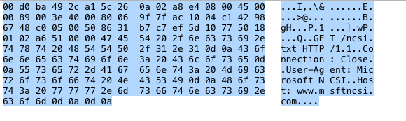

---

# A. Modelo TCP/IP

<div class="text-img">
<div>

El análisis forense de red se centra principalmente en:

<div class="list-item"><strong>Capas 2, 3 y 4</strong> del modelo OSI</div>
<div class="list-item">Las capas superiores se tratan generalmente como una única capa de aplicación</div>
<div class="list-item">Por eso se usa el <strong>modelo TCP/IP</strong> en lugar del OSI completo</div>

<div class="highlight-box">

**Ventaja**: Simplificación del modelo sin perder funcionalidad forense

</div>

</div>
<div>


</div>
</div>

---

# A. Modelo TCP/IP — Encapsulamiento

<div class="img-text">
<div>


</div>
<div>

**Proceso de encapsulamiento:**

**1. Aplicación**: Genera los datos de usuario

**2. Transporte (TCP)**: Añade cabeceras
<div class="list-item-sub">Puertos origen/destino, flags, número de secuencia</div>

**3. Red (IP)**: Añade cabeceras de enrutamiento
<div class="list-item-sub">IPs origen/destino, TTL, protocolo</div>

**4. Enlace**: Añade cabeceras y cola (FCS)
<div class="list-item-sub">MACs origen/destino, EtherType, CRC</div>

**En destino**: Se desencapsula en sentido inverso

</div>
</div>

---

# A. Encapsulamiento OSI

<div class="center-content">


**Cada capa añade su propia información de control (PDU)**

</div>

---

# A. Capas encapsuladas en Wireshark

<div class="img-text">
<div>


</div>
<div>

```
IMPORTANTE

Wireshark muestra su
interpretación de la trama.

¡Esta interpretación puede
no ser correcta!

Las capas están formadas
por bytes que aparecen de
forma secuencial en el paquete
```

</div>
</div>

---

# A. Capas encapsuladas en Wireshark

<div class="text-img">
<div>

**Visualización secuencial:**

Las capas están formadas por bytes que aparecen de forma secuencial en el paquete

<div class="list-item"><strong>Datos HTTP</strong></div>
<div class="list-item"><strong>Cabecera TCP</strong></div>
<div class="list-item"><strong>Cabecera IP</strong></div>
<div class="list-item"><strong>Cabecera Ethernet</strong></div>

</div>
<div>




</div>
</div>

---

# A. Capas encapsuladas en Wireshark

<div class="cols">
<div>


</div>
<div>

<div class="highlight-box">

**Estructura completa del paquete:**

<div class="list-item">Cada byte tiene su posición específica</div>
<div class="list-item">Los colores ayudan a identificar capas</div>
<div class="list-item">La interpretación depende del protocolo detectado</div>
<div class="list-item">Validar siempre en la vista hexadecimal</div>

</div>

</div>
</div>

---

# B. Decimal — Binario — Hexadecimal

<div class="cols">
<div>

**Base 10 (Decimal)**

<div class="list-item">Dígitos del 0 al 9</div>
<div class="list-item">198 = 1×100 + 9×10 + 8×1</div>

**Base 2 (Binario)**

<div class="list-item">Dígitos 0 y 1</div>
<div class="list-item">11000110 = 1×128 + 1×64 + 1×4 + 1×2 = 198</div>

**Base 16 (Hexadecimal)**

<div class="list-item">Dígitos del 0 al 9 y letras A-F</div>
<div class="list-item">0xC6 = 12×16 + 6×1 = 198</div>

</div>
<div>

<div class="highlight-box">

**Conversión Binario → Hex**

```
1100 0110
 ↓    ↓
 C    6
```

**Regla**: Cada 4 bits (nibble) = 1 dígito hexadecimal

</div>

**Fundamental** para leer cabeceras de protocolos en bruto

</div>
</div>

---

# B. Ejercicio — Cabecera UDP en Hex

<div class="text-img">
<div>

**Ejercicio práctico:**

Sea la cabecera UDP `0x0401 0035 004c 1fd7`

Calcular en decimal el puerto de origen y destino

**Solución:**

<div class="list-item"><strong>Origen</strong>: 0401 → 4×256 + 0×16 + 1 = <strong>1025</strong></div>
<div class="list-item"><strong>Destino</strong>: 0035 → 3×16 + 5 = <strong>53</strong> (DNS)</div>

</div>
<div>


<div class="highlight-box">

Puerto 53 = DNS

Las primeras 4 palabras de 2 bytes de la cabecera UDP son siempre puerto origen, puerto destino, longitud y checksum

</div>

</div>
</div>

---

# C. Formato libpcap

<div class="img-text">
<div>


</div>
<div>

**Cabecera del archivo (24 bytes):**

<div class="list-item"><strong>Magic number</strong>: 0xa1b2c3d4 (little-endian) o 0xd4c3b2a1 (big-endian)</div>
<div class="list-item"><strong>Version major/minor</strong>: versión del formato</div>
<div class="list-item"><strong>Timezone offset</strong>: siempre 0 (UTC)</div>
<div class="list-item"><strong>Timestamp accuracy</strong>: siempre 0</div>
<div class="list-item"><strong>Snaplen</strong>: máximo tamaño de paquete capturado</div>
<div class="list-item"><strong>Link type</strong>: tipo de enlace (1=Ethernet, 105=IEEE 802.11)</div>

**Cada registro de paquete incluye:**
<div class="list-item">Timestamp (segundos + microsegundos)</div>
<div class="list-item">Longitud capturada vs longitud original</div>

</div>
</div>

---

# C. pcap vs pcapng

<div class="cols">
<div>

**pcap (clásico)**

<div class="list-item">[X] Limitado a una interfaz</div>
<div class="list-item">[X] Metadata limitada</div>
<div class="list-item">[OK] Compatible universalmente</div>
<div class="list-item">[OK] Simple y rápido</div>

**pcapng (moderno, desde 2004)**

<div class="list-item">[OK] Múltiples interfaces</div>
<div class="list-item">[OK] Comentarios y metadata por paquete</div>
<div class="list-item">[OK] Resoluciones de nombres embebidas</div>
<div class="list-item">[!] No todas las herramientas lo soportan aún</div>

</div>
<div>

<div class="highlight-box">

**Conversión rápida:**

```bash
# pcapng → pcap
editcap -F pcap \
  archivo.pcapng archivo.pcap

# pcap → pcapng
editcap -F pcapng \
  archivo.pcap archivo.pcapng
```

</div>

Wireshark guarda en pcapng por defecto — convertir si hay problemas de compatibilidad

</div>
</div>

---

# C. pcapng — Tipos de bloques

<div class="cols">
<div>

**Bloques en pcapng:**

**Section Header Block (SHB)**
<div class="list-item-sub">Inicia cada sección, contiene metadatos del archivo</div>

**Interface Description Block (IDB)**
<div class="list-item-sub">Describe cada interfaz de captura</div>

**Enhanced Packet Block (EPB)**
<div class="list-item-sub">Contiene paquetes + timestamp + longitud + opciones</div>

**Simple Packet Block (SPB)**
<div class="list-item-sub">Paquetes sin timestamp (más ligero)</div>

</div>
<div>

**Name Resolution Block (NRB)**
<div class="list-item-sub">Mappings DNS/IP embebidos</div>

**Interface Statistics Block (ISB)**
<div class="list-item-sub">Estadísticas de la interfaz al finalizar</div>

<div class="highlight-box">

La flexibilidad de bloques permite que una captura pcapng contenga tráfico de múltiples interfaces con diferentes link types en un único archivo

</div>

</div>
</div>

---

# D. Editcap — Editar archivos PCAP

```
Editcap - Utilidad para editar archivos PCAP

  ▸ Dividir por rango de tiempo
    editcap -A "2025-01-01 00:00:00" -B "2025-01-02 00:00:00" \
      entrada.pcap salida.pcap

  ▸ Dividir por número de paquetes
    editcap -c 1000 entrada.pcap salida.pcap

  ▸ Ajustar timestamps (útil para corregir desfases NTP)
    editcap -t +3600 entrada.pcap salida.pcap

  ▸ Crear subsets de paquetes por índice
    editcap entrada.pcap salida.pcap 1-100 200-300

  ▸ Cambiar formato pcap ↔ pcapng
    editcap -F pcap archivo.pcapng archivo.pcap

  ▸ Eliminar paquetes duplicados
    editcap -d entrada.pcap salida.pcap
```

---

# D. Mergecap y Capinfos

<div class="cols">
<div>

## Mergecap — Combinar PCAPs

```bash
# Combinar múltiples archivos
mergecap -w salida.pcap \
  archivo1.pcap archivo2.pcap

# Múltiples interfaces en pcapng
mergecap -w salida.pcapng \
  eth0.pcap wlan0.pcap

# Ordenar por timestamp
mergecap -w salida.pcap \
  -F pcap *.pcap
```

Útil para consolidar capturas de múltiples sensores

</div>
<div>

## Capinfos — Información del PCAP

```bash
capinfos captura.pcap
capinfos -T captura.pcap  # tabla
capinfos -l captura.pcap  # largo
```

**Muestra:**
<div class="list-item">Formato y encapsulación</div>
<div class="list-item">Número total de paquetes</div>
<div class="list-item">Timestamps inicio/fin y duración</div>
<div class="list-item">Bytes y bitrate promedio</div>

<div class="highlight-box">

Siempre ejecutar `capinfos` al recibir un PCAP para validar su integridad

</div>

</div>
</div>

---

# E. Capa de enlace — IEEE 802.x

<div class="cols">
<div>

**Conjunto de estándares del IEEE:**

<div class="list-item"><strong>802.3</strong> — Ethernet</div>
<div class="list-item"><strong>802.11</strong> — WiFi</div>
<div class="list-item"><strong>802.15.1</strong> — Bluetooth</div>

**Ethernet II (el más común en redes corporativas):**

<div class="list-item">14 bytes de cabecera + payload variable + 4 bytes CRC</div>
<div class="list-item">Campo <strong>EtherType</strong> identifica el protocolo L3:</div>
<div class="list-item-sub">IPv4: <code>0x0800</code> | IPv6: <code>0x86DD</code></div>
<div class="list-item-sub">ARP: <code>0x0806</code> | VLAN 802.1Q: <code>0x8100</code></div>
<div class="list-item">Tamaño mínimo de trama: 14 + 46 + 4 bytes</div>

</div>
<div>


</div>
</div>

---

# E. Internet Protocol — Características

<div class="cols">
<div>

**Diseñado para:**

<div class="list-item">Manejar el <strong>enrutamiento</strong> y el <strong>direccionamiento</strong> entre redes</div>
<div class="list-item">Operar en <strong>capa 3</strong> del modelo OSI</div>

**Propiedades:**

<div class="list-item"><strong>No orientado a conexión</strong> — cada paquete es independiente</div>
<div class="list-item"><strong>No confiable</strong> — best-effort delivery</div>
<div class="list-item">Sin garantía de entrega, orden ni ausencia de duplicados</div>
<div class="list-item">La fiabilidad la aporta TCP en la capa superior</div>

</div>
<div>

<div class="highlight-box">

**Cabecera IP + Payload = Paquete IP**

Campos forenses clave:
<div class="list-item"><strong>TTL</strong>: identifica el SO origen</div>
<div class="list-item-sub">Windows=128, Linux=64, Router=255</div>
<div class="list-item"><strong>Protocol</strong>: TCP=6, UDP=17, ICMP=1</div>
<div class="list-item"><strong>Flags</strong>: fragmentación DF/MF</div>
<div class="list-item"><strong>ID</strong>: identifica fragmentos del mismo datagrama</div>

</div>

</div>
</div>
