---

# Apéndices — Network Forensics

<div class="center-content">

## Material para profundizar o recordar

</div>

---


# A. Modelo TCP/IP
<div class="text-img">
<div>
El análisis forense de red se centra principalmente en:

<div class="list-item"><strong>Capas 2, 3 y 4</strong> del modelo OSI</div>
<div class="list-item">Las capas superiores se tratan generalmente como una única capa de aplicación</div>
<div class="list-item">Por eso se usa el <strong>modelo TCP/IP</strong> en lugar del OSI completo</div>

<div class="highlight-box">

**Ventaja**: Simplificación del modelo sin perder funcionalidad forense

</div>

</div>
<div>

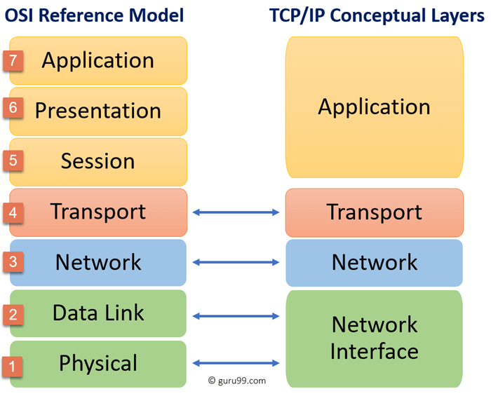

</div>
</div>

---

# A. Modelo TCP/IP — Encapsulamiento

<div class="img-text">
<div>

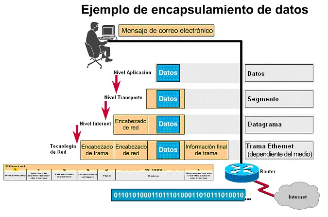

</div>
<div>

**Proceso de encapsulamiento:**

**1. Aplicación**: Genera los datos de usuario

**2. Transporte (TCP)**: Añade cabeceras
<div class="list-item-sub">Puertos origen/destino, flags, número de secuencia</div>

**3. Red (IP)**: Añade cabeceras de enrutamiento
<div class="list-item-sub">IPs origen/destino, TTL, protocolo</div>

**4. Enlace**: Añade cabeceras y cola (FCS)
<div class="list-item-sub">MACs origen/destino, EtherType, CRC</div>

**En destino**: Se desencapsula en sentido inverso

</div>
</div>

---

# A. Encapsulamiento OSI

<div class="center-content">

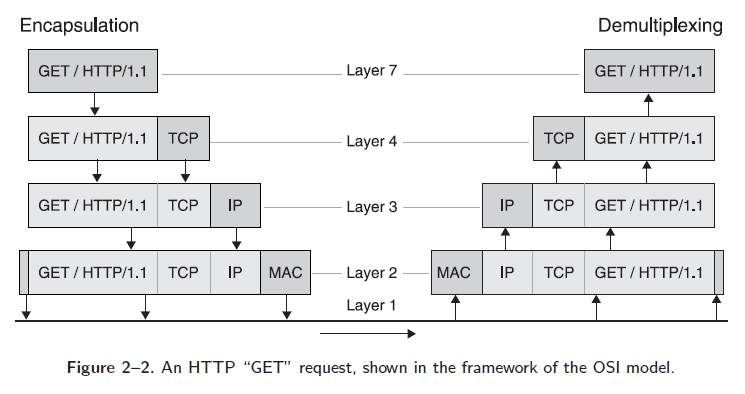

**Cada capa añade su propia información de control (PDU)**

</div>

---

# A. Capas encapsuladas en Wireshark

<div class="img-text">
<div>

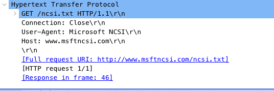

</div>
<div>

```
IMPORTANTE

Wireshark muestra su
interpretación de la trama.

¡Esta interpretación puede
no ser correcta!

Las capas están formadas
por bytes que aparecen de
forma secuencial en el paquete
```

</div>
</div>

---

# A. Capas encapsuladas en Wireshark

<div class="text-img">
<div>

**Visualización secuencial:**

Las capas están formadas por bytes que aparecen de forma secuencial en el paquete

<div class="list-item"><strong>Datos HTTP</strong></div>
<div class="list-item"><strong>Cabecera TCP</strong></div>
<div class="list-item"><strong>Cabecera IP</strong></div>
<div class="list-item"><strong>Cabecera Ethernet</strong></div>

</div>
<div>

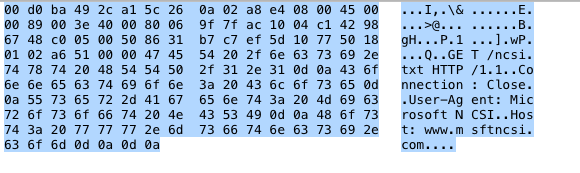

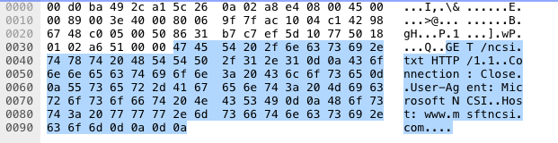

</div>
</div>

---

# A. Capas encapsuladas en Wireshark

<div class="cols">
<div>

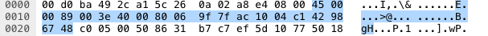

</div>
<div>

<div class="highlight-box">

**Estructura completa del paquete:**

<div class="list-item">Cada byte tiene su posición específica</div>
<div class="list-item">Los colores ayudan a identificar capas</div>
<div class="list-item">La interpretación depende del protocolo detectado</div>
<div class="list-item">Validar siempre en la vista hexadecimal</div>

</div>

</div>
</div>

---

# B. Decimal — Binario — Hexadecimal

<div class="cols">
<div>

**Base 10 (Decimal)**

<div class="list-item">Dígitos del 0 al 9</div>
<div class="list-item">198 = 1×100 + 9×10 + 8×1</div>

**Base 2 (Binario)**

<div class="list-item">Dígitos 0 y 1</div>
<div class="list-item">11000110 = 1×128 + 1×64 + 1×4 + 1×2 = 198</div>

**Base 16 (Hexadecimal)**

<div class="list-item">Dígitos del 0 al 9 y letras A-F</div>
<div class="list-item">0xC6 = 12×16 + 6×1 = 198</div>

</div>
<div>

<div class="highlight-box">

**Conversión Binario → Hex**

```
1100 0110
 ↓    ↓
 C    6
```

**Regla**: Cada 4 bits (nibble) = 1 dígito hexadecimal

</div>

**Fundamental** para leer cabeceras de protocolos en bruto

</div>
</div>

---

# B. Ejercicio — Cabecera UDP en Hex

<div class="text-img">
<div>

**Ejercicio práctico:**

Sea la cabecera UDP `0x0401 0035 004c 1fd7`

Calcular en decimal el puerto de origen y destino

**Solución:**

<div class="list-item"><strong>Origen</strong>: 0401 → 4×256 + 0×16 + 1 = <strong>1025</strong></div>
<div class="list-item"><strong>Destino</strong>: 0035 → 3×16 + 5 = <strong>53</strong> (DNS)</div>

</div>
<div>

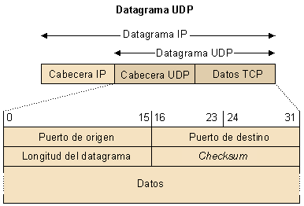

<div class="highlight-box">

Puerto 53 = DNS

Las primeras 4 palabras de 2 bytes de la cabecera UDP son siempre puerto origen, puerto destino, longitud y checksum

</div>

</div>
</div>

---

# C. Formato libpcap

<div class="img-text">
<div>

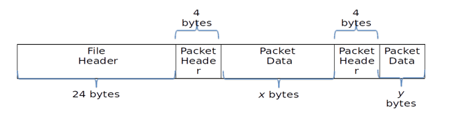

</div>
<div>

**Cabecera del archivo (24 bytes):**

<div class="list-item"><strong>Magic number</strong>: 0xa1b2c3d4 (little-endian) o 0xd4c3b2a1 (big-endian)</div>
<div class="list-item"><strong>Version major/minor</strong>: versión del formato</div>
<div class="list-item"><strong>Timezone offset</strong>: siempre 0 (UTC)</div>
<div class="list-item"><strong>Timestamp accuracy</strong>: siempre 0</div>
<div class="list-item"><strong>Snaplen</strong>: máximo tamaño de paquete capturado</div>
<div class="list-item"><strong>Link type</strong>: tipo de enlace (1=Ethernet, 105=IEEE 802.11)</div>

**Cada registro de paquete incluye:**
<div class="list-item">Timestamp (segundos + microsegundos)</div>
<div class="list-item">Longitud capturada vs longitud original</div>

</div>
</div>

---

# C. pcap vs pcapng

<div class="cols">
<div>

**pcap (clásico)**

<div class="list-item">[X] Limitado a una interfaz</div>
<div class="list-item">[X] Metadata limitada</div>
<div class="list-item">[OK] Compatible universalmente</div>
<div class="list-item">[OK] Simple y rápido</div>

**pcapng (moderno, desde 2004)**

<div class="list-item">[OK] Múltiples interfaces</div>
<div class="list-item">[OK] Comentarios y metadata por paquete</div>
<div class="list-item">[OK] Resoluciones de nombres embebidas</div>
<div class="list-item">[!] No todas las herramientas lo soportan aún</div>

</div>
<div>

<div class="highlight-box">

**Conversión rápida:**

```bash
# pcapng → pcap
editcap -F pcap \
  archivo.pcapng archivo.pcap

# pcap → pcapng
editcap -F pcapng \
  archivo.pcap archivo.pcapng
```

</div>

Wireshark guarda en pcapng por defecto — convertir si hay problemas de compatibilidad

</div>
</div>

---

# C. pcapng — Tipos de bloques

<div class="cols">
<div>

**Bloques en pcapng:**

**Section Header Block (SHB)**
<div class="list-item-sub">Inicia cada sección, contiene metadatos del archivo</div>

**Interface Description Block (IDB)**
<div class="list-item-sub">Describe cada interfaz de captura</div>

**Enhanced Packet Block (EPB)**
<div class="list-item-sub">Contiene paquetes + timestamp + longitud + opciones</div>

**Simple Packet Block (SPB)**
<div class="list-item-sub">Paquetes sin timestamp (más ligero)</div>

</div>
<div>

**Name Resolution Block (NRB)**
<div class="list-item-sub">Mappings DNS/IP embebidos</div>

**Interface Statistics Block (ISB)**
<div class="list-item-sub">Estadísticas de la interfaz al finalizar</div>

<div class="highlight-box">

La flexibilidad de bloques permite que una captura pcapng contenga tráfico de múltiples interfaces con diferentes link types en un único archivo

</div>

</div>
</div>

---

# D. Editcap — Editar archivos PCAP

```
Editcap - Utilidad para editar archivos PCAP

  ▸ Dividir por rango de tiempo
    editcap -A "2025-01-01 00:00:00" -B "2025-01-02 00:00:00" \
      entrada.pcap salida.pcap

  ▸ Dividir por número de paquetes
    editcap -c 1000 entrada.pcap salida.pcap

  ▸ Ajustar timestamps (útil para corregir desfases NTP)
    editcap -t +3600 entrada.pcap salida.pcap

  ▸ Crear subsets de paquetes por índice
    editcap entrada.pcap salida.pcap 1-100 200-300

  ▸ Cambiar formato pcap ↔ pcapng
    editcap -F pcap archivo.pcapng archivo.pcap

  ▸ Eliminar paquetes duplicados
    editcap -d entrada.pcap salida.pcap
```

---

# D. Mergecap y Capinfos

<div class="cols">
<div>

## Mergecap — Combinar PCAPs

```bash
# Combinar múltiples archivos
mergecap -w salida.pcap \
  archivo1.pcap archivo2.pcap

# Múltiples interfaces en pcapng
mergecap -w salida.pcapng \
  eth0.pcap wlan0.pcap

# Ordenar por timestamp
mergecap -w salida.pcap \
  -F pcap *.pcap
```

Útil para consolidar capturas de múltiples sensores

</div>
<div>

## Capinfos — Información del PCAP

```bash
capinfos captura.pcap
capinfos -T captura.pcap  # tabla
capinfos -l captura.pcap  # largo
```

**Muestra:**
<div class="list-item">Formato y encapsulación</div>
<div class="list-item">Número total de paquetes</div>
<div class="list-item">Timestamps inicio/fin y duración</div>
<div class="list-item">Bytes y bitrate promedio</div>

<div class="highlight-box">

Siempre ejecutar `capinfos` al recibir un PCAP para validar su integridad

</div>

</div>
</div>

---

# E. Capa de enlace — IEEE 802.x

<div class="cols">
<div>

**Conjunto de estándares del IEEE:**

<div class="list-item"><strong>802.3</strong> — Ethernet</div>
<div class="list-item"><strong>802.11</strong> — WiFi</div>
<div class="list-item"><strong>802.15.1</strong> — Bluetooth</div>

**Ethernet II (el más común en redes corporativas):**

<div class="list-item">14 bytes de cabecera + payload variable + 4 bytes CRC</div>
<div class="list-item">Campo <strong>EtherType</strong> identifica el protocolo L3:</div>
<div class="list-item-sub">IPv4: <code>0x0800</code> | IPv6: <code>0x86DD</code></div>
<div class="list-item-sub">ARP: <code>0x0806</code> | VLAN 802.1Q: <code>0x8100</code></div>
<div class="list-item">Tamaño mínimo de trama: 14 + 46 + 4 bytes</div>

</div>
<div>

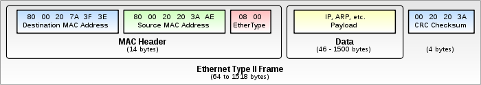

</div>
</div>

---

# E. Internet Protocol — Características

<div class="cols">
<div>

**Diseñado para:**

<div class="list-item">Manejar el <strong>enrutamiento</strong> y el <strong>direccionamiento</strong> entre redes</div>
<div class="list-item">Operar en <strong>capa 3</strong> del modelo OSI</div>

**Propiedades:**

<div class="list-item"><strong>No orientado a conexión</strong> — cada paquete es independiente</div>
<div class="list-item"><strong>No confiable</strong> — best-effort delivery</div>
<div class="list-item">Sin garantía de entrega, orden ni ausencia de duplicados</div>
<div class="list-item">La fiabilidad la aporta TCP en la capa superior</div>

</div>
<div>

<div class="highlight-box">

**Cabecera IP + Payload = Paquete IP**

Campos forenses clave:
<div class="list-item"><strong>TTL</strong>: identifica el SO origen</div>
<div class="list-item-sub">Windows=128, Linux=64, Router=255</div>
<div class="list-item"><strong>Protocol</strong>: TCP=6, UDP=17, ICMP=1</div>
<div class="list-item"><strong>Flags</strong>: fragmentación DF/MF</div>
<div class="list-item"><strong>ID</strong>: identifica fragmentos del mismo datagrama</div>

</div>

</div>
</div>

---

# F. Crear filtros en Wireshark — Opción 2

<div class="highlight-box">

**Opción 2:** Botón **Expression** — selección guiada por protocolo y campo

</div>

<div class="center-content">


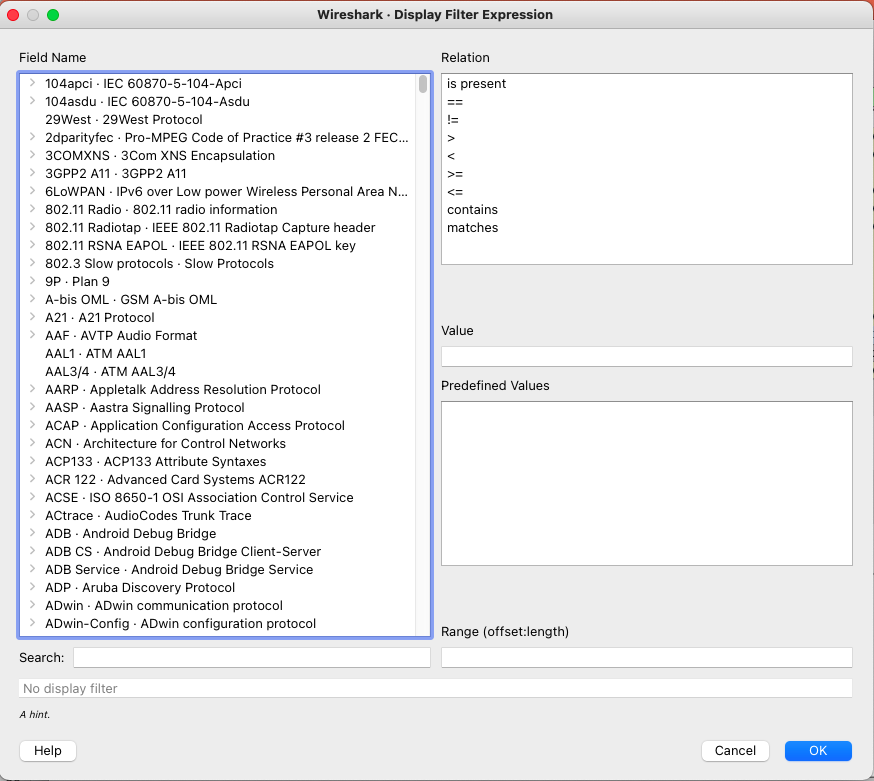

</div>

---

# F. Crear filtros en Wireshark — Opción 3

<div class="highlight-box">

**Opción 3:** Click derecho sobre un paquete o campo → *Apply as Filter*

</div>

<div class="center-content">

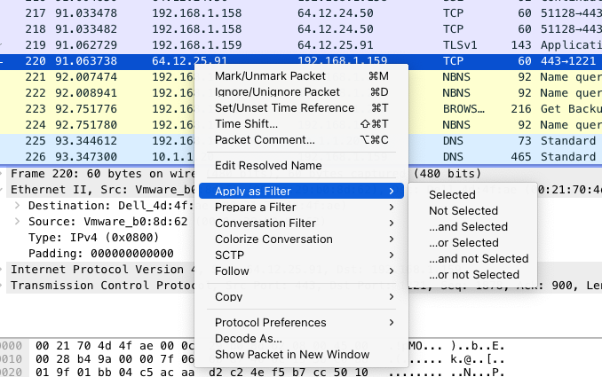

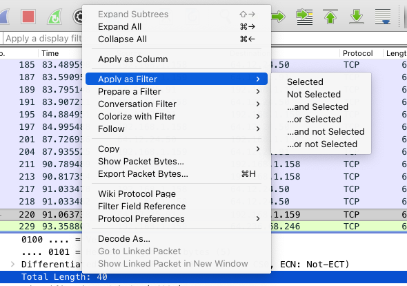

</div>

---

# F. TCP — Establecimiento de Conexión (3-Way Handshake)

<div class="center-content">

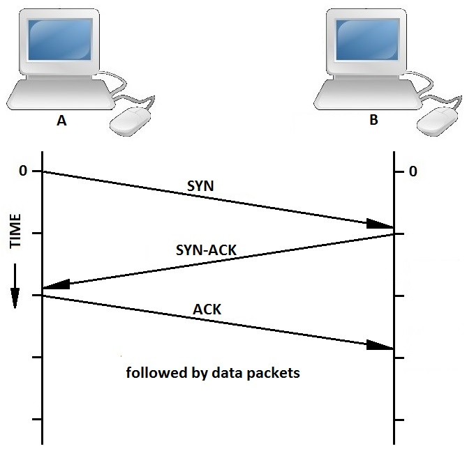

</div>

---

# F. TCP — Fin de Conexión (4-Way Teardown)

<div class="center-content">

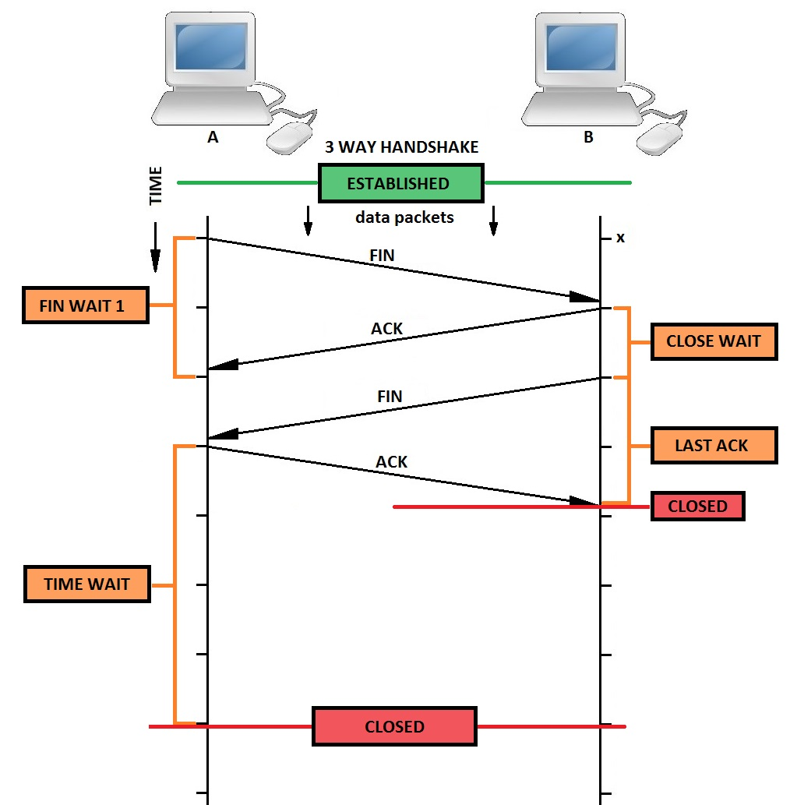

</div>

---

# G. Capa de enlace IEEE 802.x — Trama

<div class="center-content">


**Tamaño mínimo de trama:** 14 + 46 + 4 bytes (mecanismo anti-colisiones)

</div>

---

# G. Capa de enlace IEEE 802.x — Wireshark

<div class="center-content">

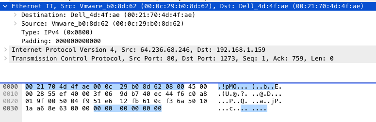

</div>

---

# G. Cabecera de IPv4

<div class="img-text">
<div>


</div>
<div>

**Campos clave:**

<div class="list-item"><strong>Versión</strong>: 4 (IPv4) o 6 (IPv6) — otro valor → descarte</div>
<div class="list-item"><strong>Protocol</strong>: tipo de capa 4 encapsulada</div>
<div class="list-item-sub">ICMP: 1 | TCP: 6 | UDP: 17 (0x11)</div>
<div class="list-item"><strong>TTL</strong>: saltos máximos antes del descarte</div>
<div class="list-item-sub">Windows: 128 | Linux: 64 | Routers: 255</div>
<div class="list-item"><strong>ECN</strong>: notificación de congestión</div>
<div class="list-item-sub">00 = No ECN | 01/10 = ECN-Aware | 11 = Congestión</div>

</div>
</div>

---

# G. Cabecera IPv4 — Campos adicionales

<div class="cols">
<div>

**Tamaño y calidad de servicio:**

<div class="list-item"><strong>IHL</strong>: longitud de cabecera en palabras de 32 bits</div>
<div class="list-item-sub">Mínimo: 5 (20 bytes) | Máximo: 15 (60 bytes)</div>
<div class="list-item"><strong>DSCP/ToS</strong>: prioridad y clase de tráfico</div>
<div class="list-item-sub">VoIP, vídeo → valores elevados de DSCP</div>
<div class="list-item"><strong>Total Length</strong>: tamaño total del paquete (cabecera + datos)</div>
<div class="list-item-sub">Máximo: 65 535 bytes</div>

</div>
<div>

**Fragmentación e integridad:**

<div class="list-item"><strong>Identification</strong>: ID común a todos los fragmentos del mismo datagrama</div>
<div class="list-item"><strong>Flags</strong>: control de fragmentación</div>
<div class="list-item-sub">DF (Don't Fragment) | MF (More Fragments)</div>
<div class="list-item"><strong>Fragment Offset</strong>: posición del fragmento (múltiplo de 8 bytes)</div>
<div class="list-item"><strong>Header Checksum</strong>: verificación de integridad solo de la cabecera</div>
<div class="list-item-sub">Recalculado en cada router (el TTL cambia)</div>

</div>
</div>

---

# G. TCP vs UDP — Cabeceras

<div class="center-content">

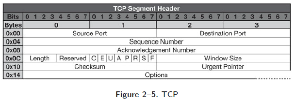

</div>

---

# G. UDP — En Wireshark

<div class="center-content">

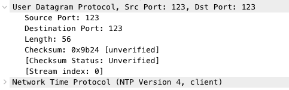

**Tamaño mínimo:** 8 bytes (solo cabecera) — si vale 0 = jumbograma

</div>

---

# H. Fuentes — WiFi y Switches

<div class="cols">
<div>

## Redes WiFi (WLAN)

<div class="list-item">Información normalmente cifrada (WPA2/WPA3)</div>
<div class="list-item">**Frames de gestión y control no suelen ir cifradas:**</div>
<div class="list-item-sub">APs anuncian SSID, presencia y capacidades</div>
<div class="list-item-sub">MACs de equipos autenticados</div>
<div class="list-item-sub">Análisis de volumen de tráfico</div>
<div class="list-item">En WPA2 con PSK: se puede descifrar con la clave</div>

</div>
<div>

## Switches (Capa 2)

<div class="list-item">Interconectan segmentos de red locales</div>
<div class="list-item">**Tabla CAM (Content Addressable Memory):**</div>
<div class="list-item-sub">Mapea puertos físicos → MACs</div>
<div class="list-item-sub">Permite ubicar físicamente un dispositivo</div>
<div class="list-item-sub">Clave para localizar un equipo comprometido</div>

<div class="highlight-box">

`show mac address-table | include [MAC]`

</div>

</div>
</div>

---

# H. Fuentes — Routers

<div class="cols">
<div>

**Función:**

<div class="list-item">Conectan y encaminan tráfico entre diferentes redes</div>
<div class="list-item">Permiten comunicación MAN/WAN/LAN</div>

**Información forense:**

<div class="list-item"><strong>Tablas de enrutamiento</strong> — el path de las comunicaciones</div>
<div class="list-item"><strong>Filtrado de paquetes</strong> — ACLs aplicadas</div>
<div class="list-item"><strong>Logs de acceso</strong> — eventos de conexión</div>
<div class="list-item"><strong>Información de flujos</strong> — NetFlow/IPFIX</div>

</div>
<div>

<div class="highlight-box">

Los routers son los **IDS más desplegados** (y más rudimentarios):

<div class="list-item">Todos tienen ACLs</div>
<div class="list-item">Muchos tienen NetFlow habilitado</div>
<div class="list-item">Los logs suelen ir a un SIEM o syslog</div>

</div>

<div class="warn-box">

Los logs del router pueden ser la única fuente de evidencia cuando no hay PCAP

</div>

</div>
</div>

---

# H. Fuentes — Autenticación y NIDS

<div class="cols">
<div>

## Servidores de Autenticación (AD/LDAP/RADIUS)

<div class="list-item">Servicios de autenticación centralizada</div>
<div class="list-item">Provisionamiento y auditoría de cuentas</div>
<div class="list-item">**Información forense:**</div>
<div class="list-item-sub">Intentos fallidos → fuerza bruta</div>
<div class="list-item-sub">Éxitos en horas sospechosas</div>
<div class="list-item-sub">Localizaciones no habituales para el usuario</div>
<div class="list-item-sub">Cambios de privilegios inesperados</div>

</div>
<div>

## NIDS/NIPS

<div class="list-item">Monitorizan tráfico en tiempo real</div>
<div class="list-item">Detectan y alertan de eventos sospechosos</div>
<div class="list-item">**Información forense:**</div>
<div class="list-item-sub">Actividades sospechosas en curso</div>
<div class="list-item-sub">Tráfico hacia C2 conocidos</div>
<div class="list-item-sub">Fugas de información</div>
<div class="list-item-sub">Recuperación de contenido completo (en algunos casos)</div>
<div class="list-item-sub">Normalmente: IP origen/destino, puertos, timestamp</div>

</div>
</div>

---

# H. Fuentes — Firewalls y Proxies

<div class="cols">
<div>

## Firewalls (NGFW)

<div class="list-item">Inspección con tres acciones: permitir, descartar, registrar</div>
<div class="list-item">Basados en IP, puerto, protocolo y payload</div>
<div class="list-item">**Información forense:**</div>
<div class="list-item-sub">Log granular de tráfico permitido y denegado</div>
<div class="list-item-sub">Logs de cambios de configuración</div>
<div class="list-item-sub">Alertas IPS integradas</div>
<div class="list-item-sub">Identificación de aplicaciones (L7)</div>

</div>
<div>

## Proxies Web

<div class="list-item">Mejoran rendimiento mediante caché</div>
<div class="list-item">Registran, inspeccionan y filtran tráfico web</div>
<div class="list-item">**Información forense:**</div>
<div class="list-item-sub">Logs granulares de navegación (larga retención)</div>
<div class="list-item-sub">Perfiles de navegación por IP / usuario</div>
<div class="list-item-sub">Detección de phishing exitoso</div>
<div class="list-item-sub">Identificación de malware web</div>
<div class="list-item-sub">Contenido cacheado (lo que vio el usuario)</div>

</div>
</div>

---

# H. Fuentes — Servidores de Aplicación y SIEM

<div class="cols">
<div>

## Servidores de Aplicación

<div class="list-item">Bases de datos</div>
<div class="list-item">Servidores Web</div>
<div class="list-item">Servidores de correo (SMTP/IMAP)</div>
<div class="list-item">Servidores de mensajería (IM)</div>
<div class="list-item">Servidores VoIP</div>

<div class="highlight-box">

Guardan logs de sus aplicaciones — **esenciales** para descifrar qué ocurrió realmente a nivel de aplicación

</div>

</div>
<div>

## SIEM / Logs Centralizados

<div class="list-item">Combina logs de muchas fuentes</div>
<div class="list-item">Correlación, análisis y fechado automático</div>
<div class="list-item">**Valor forense:**</div>
<div class="list-item-sub">Diseñado para identificar y responder a incidentes</div>
<div class="list-item-sub">Salva la información si un servidor es comprometido</div>
<div class="list-item-sub">Retiene datos durante más tiempo que los dispositivos</div>
<div class="list-item-sub">Análisis forense y visualización temporal</div>

</div>
</div>

---

# I. NetFlow v9 — Formato

<div class="center-content">

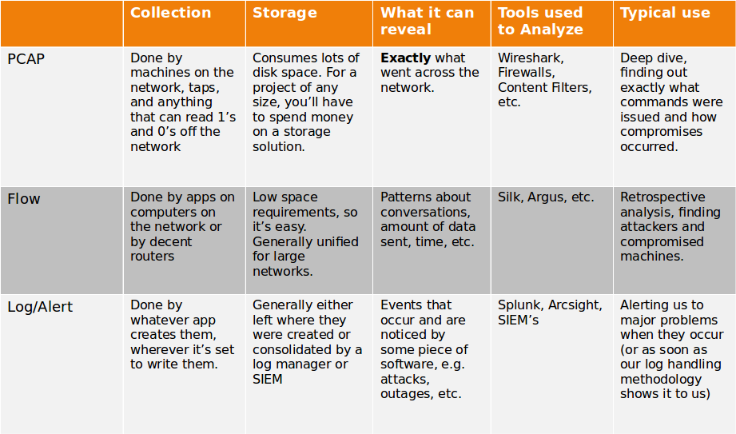

</div>

---

# I. SNMP vs *Flow

<div class="cols">
<div>

## SNMP (polling)

<div class="list-item">El gestor solicita información al dispositivo</div>
<div class="list-item">Necesita decidir <strong>cuándo</strong> hacer el poll</div>
<div class="list-item">Para cuando se hace el poll, la info puede no estar</div>
<div class="list-item">La correlación requiere múltiples peticiones</div>

</div>
<div>

## NetFlow (push)

<div class="list-item">La información se manda <strong>de forma asíncrona</strong></div>
<div class="list-item">Postprocesado posible en el router/switch</div>
<div class="list-item">La información se borra del equipo tras exportar</div>
<div class="list-item">Escalable — cada router/switch es un sensor</div>

<div class="highlight-box">

Los flows son la forma de **telemetría** enviada por routers y switches

</div>

</div>
</div>

---

# I. De Dónde se Obtienen los Flows

<div class="cols">
<div>

**Fuentes:**

<div class="list-item">Del <strong>router o switch</strong> directamente (NetFlow/sFlow)</div>
<div class="list-item">Generados a partir de un <strong>PCAP existente</strong></div>
<div class="list-item">Generados por <strong>probes de red</strong> en tiempo real</div>

</div>
<div>

<div class="warn-box">

**Limitaciones:**

<div class="list-item">Capacidad del enlace analizado</div>
<div class="list-item">Recursos de hardware del dispositivo</div>
<div class="list-item">Muestreo (sFlow) → no todos los paquetes</div>

</div>

</div>
</div>

---

# I. Infraestructura FPC

<div class="cols">
<div>

## Network TAPs (preferido)

<div class="list-item">TAP físico — tráfico idéntico al original</div>
<div class="list-item">No requiere SPAN port</div>
<div class="list-item">No descarta paquetes en caso de saturación</div>

## NICs de captura

<div class="list-item">Tarjetas con chips especializados</div>
<div class="list-item">Capaces de procesar tráfico de alta velocidad</div>
<div class="list-item">Con timestamping hardware de alta precisión</div>

</div>
<div>

## Filtrado BPF en captura

<div class="list-item">No todo el tráfico en el TAP es útil</div>
<div class="list-item-sub">Tráfico del propio FPC, tráfico de backup</div>
<div class="list-item">Soportado por OpenFPC, Snort, Suricata, Arkime</div>

## Packet Brokers

<div class="list-item">Para tráfico excesivamente alto</div>
<div class="list-item">Balanceo de carga entre sensores</div>
<div class="list-item">Filtrado L2-L7 y descifrado</div>

</div>
</div>

---

# J. APT Kill Chain — Indicadores de Red

<div class="cols">
<div>

| Fase | Indicadores en PCAP |
|------|---------------------|
| **Reconnaissance** | DNS masivas, patrones Shodan, SYN a rangos de IP |
| **Delivery** | HTTP download .doc/.zip, User-Agent de herramienta |
| **Exploitation** | Payload anómalo, respuestas de error del servidor |
| **C2** | HTTPS con JA3 malicioso, DGA domains, beaconing |
| **Lateral Movement** | SMB admin$, RDP, WMI entre hosts internos |
| **Exfiltration** | DNS tunneling, uploads grandes, ICMP con payload |

</div>
<div>

<div class="highlight-box">

**Regla práctica:**

Cada fase deja huellas distintas — el PCAP es el registro completo de la actividad del atacante

</div>

<div class="warn-box">

APTs sofisticados operan durante **meses** antes de la detección — la retención de flows históricos es crítica

</div>

</div>
</div>
---
